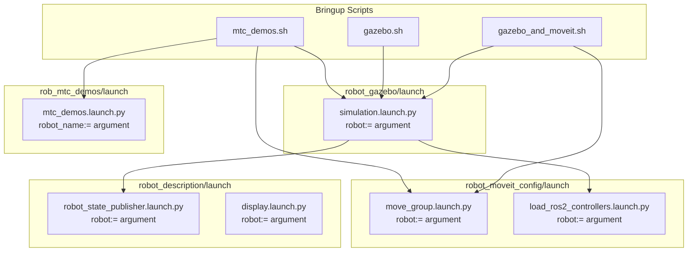
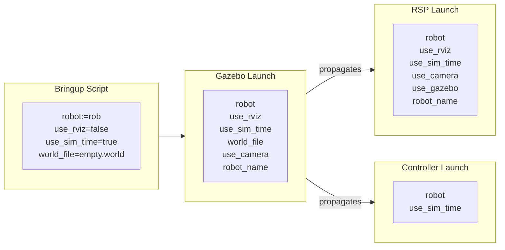

# Launch Flow

This document describes the launch file hierarchy, which nodes each file spawns, and how launch arguments propagate through the system.

## Launch Hierarchy Overview



---

## Bringup Scripts

Located in `src/robot_arm/rob_bringup/scripts/`

All scripts accept a `robot` argument (panda, rob, or bb01) to select which robot to launch.

### gazebo_and_moveit.sh

Launches complete simulation with motion planning for any robot.

**Usage:**
```bash
./gazebo_and_moveit.sh [robot]
# robot: panda, rob (default), or bb01
```

**Execution order:**
1. `ros2 launch robot_gazebo simulation.launch.py robot:=$ROBOT` (background)
2. Wait 15 seconds for Gazebo to initialize
3. `ros2 launch robot_moveit_config move_group.launch.py robot:=$ROBOT` (background)
4. Adjust Gazebo camera position

**Key arguments passed:**
- `robot:=$ROBOT` (panda, rob, or bb01)
- `load_controllers:=true`
- `world_file:=empty.world`
- `use_camera:=false`
- `use_rviz:=false`

### gazebo.sh

Launches Gazebo simulation only (no MoveIt).

**Usage:**
```bash
./gazebo.sh [robot]
```

### mtc_demos.sh

Launches Gazebo, MoveIt, and MTC demos.

**Usage:**
```bash
./mtc_demos.sh [robot] [exe_option]
# robot: panda, rob (default), or bb01
# exe_option: alternative_path_costs (default), cartesian, fallbacks_move_to, ik_clearance_cost, or modular
```

---

## Gazebo Launch Files

Located in `src/robot_arm/robot_gazebo/launch/`

### simulation.launch.py

**Purpose:** Unified parametric launch file for Gazebo simulation with any robot

**Robot Selection:**
The robot is selected via the `robot:=` argument:
- `robot:=panda` - Load Panda robot
- `robot:=rob` - Load Rob robot (default)
- `robot:=bb01` - Load BB01 robot

**Nodes spawned:**
| Node | Package | Purpose |
|------|---------|---------|
| `ros_gz_sim` | ros_gz_sim | Gazebo simulator |
| `parameter_bridge` | ros_gz_bridge | ROS-Gazebo topic bridge |
| `image_bridge` | ros_gz_image | Camera image bridge (if enabled) |
| `create` | ros_gz_sim | Robot spawner |

**Included launch files:**
- `robot_description/launch/robot_state_publisher.launch.py` (with `robot:=` argument)
- `robot_moveit_config/launch/load_ros2_controllers.launch.py` (with `robot:=` argument)

**Key arguments:**

| Argument | Default | Description |
|----------|---------|-------------|
| `robot` | `rob` | Robot to simulate (panda, rob, bb01) |
| `world_file` | `empty.world` | Gazebo world to load |
| `use_rviz` | `false` | Launch RViz |
| `use_sim_time` | `true` | Use simulation time |
| `use_camera` | `false` | Enable RGBD camera |
| `load_controllers` | `true` | Load ros2_control controllers |
| `x`, `y`, `z` | `0.0, 0.0, 0.1` | Robot spawn position |
| `roll`, `pitch`, `yaw` | `0.0` | Robot spawn orientation |

**Available worlds:**
- `empty.world` - Empty environment
- `house.world` - Indoor house environment
- `pick_and_place_demo.world` - Demo with table and objects
- `fruits.world` - Environment with fruit objects

---

## Description Launch Files

Located in `src/robot_arm/robot_description/launch/`

### robot_state_publisher.launch.py

**Purpose:** Publish robot state and optionally start visualization

**Robot Selection:**
Selected via `robot:=` argument (panda, rob, bb01)

**Nodes spawned:**
| Node | Package | Condition |
|------|---------|-----------|
| `robot_state_publisher` | robot_state_publisher | Always |
| `joint_state_publisher` | joint_state_publisher | If `use_gazebo=false` and `jsp_gui=false` |
| `joint_state_publisher_gui` | joint_state_publisher_gui | If `use_gazebo=false` and `jsp_gui=true` |
| `rviz2` | rviz2 | If `use_rviz=true` |

**Key arguments:**

| Argument | Default | Description |
|----------|---------|-------------|
| `robot` | `rob` | Robot name (panda, rob, bb01) |
| `add_world` | `true` | Add world link to URDF |
| `use_camera` | `false` | Include camera in URDF |
| `use_gazebo` | `false` | Configure for Gazebo |
| `jsp_gui` | `true` | Use GUI joint publisher |
| `use_rviz` | `true` | Launch RViz |
| `use_sim_time` | `false` | Use simulation time |

### display.launch.py

**Purpose:** Simple robot visualization in RViz

**Robot Selection:**
Selected via `robot:=` argument (panda, rob, bb01)

**Nodes spawned:**
- `robot_state_publisher`
- `joint_state_publisher_gui`
- `rviz2`

**Key arguments:**

| Argument | Default | Description |
|----------|---------|-------------|
| `robot` | `rob` | Robot name (panda, rob, bb01) |

---

## MoveIt Launch Files

Located in `src/robot_arm/robot_moveit_config/launch/`

### move_group.launch.py

**Purpose:** Start the MoveIt move_group node for motion planning

**Robot Selection:**
Selected via `robot:=` argument (panda, rob, bb01)

**Nodes spawned:**
| Node | Package | Purpose |
|------|---------|---------|
| `move_group` | moveit_ros_move_group | Motion planning server |
| `rviz2` | rviz2 | MoveIt RViz (if enabled) |

**MoveIt Configuration loaded:**
- Kinematics solver (KDL)
- Planning pipelines (OMPL, Pilz, STOMP)
- Controller configuration
- Joint limits
- SRDF (semantic robot description)

All configs are loaded from `robot_moveit_config/robots/<robot>/config/` based on the `robot:=` argument.

**Key arguments:**

| Argument | Default | Description |
|----------|---------|-------------|
| `robot` | `rob` | Robot name (panda, rob, bb01) |
| `use_sim_time` | `true` | Use simulation time |
| `use_rviz` | `true` | Launch MoveIt RViz |
| `rviz_config_file` | `move_group.rviz` | RViz config |
| `rviz_config_package` | `robot_moveit_config` | Package containing RViz config |

### load_ros2_controllers.launch.py

**Purpose:** Spawn ros2_control controllers

**Robot Selection:**
Selected via `robot:=` argument (panda, rob, bb01)

**Controllers loaded:**
- `joint_state_broadcaster` - Publishes joint states
- `joint_trajectory_controller` - Arm trajectory execution
- `gripper_controller` - Gripper control (if applicable)

Controller configuration is loaded from `robot_moveit_config/robots/<robot>/config/ros2_controllers.yaml`.

---

## MTC Demo Launch Files

### mtc_demos.launch.py

Located in `src/robot_arm/rob_mtc_demos/launch/`

**Purpose:** Run MoveIt Task Constructor demonstrations

**Robot Selection:**
Selected via `robot_name:=` argument (panda, rob, bb01)

**Nodes spawned:**
| Node | Package | Purpose |
|------|---------|---------|
| MTC demo node | rob_mtc_demos | Execute selected demo |

**Key arguments:**

| Argument | Default | Description |
|----------|---------|-------------|
| `robot_name` | `rob` | Robot name (panda, rob, bb01) |
| `use_sim_time` | `true` | Use simulation time |
| `exe` | `alternative_path_costs` | Demo executable |

**Available demos:**
- `alternative_path_costs`
- `cartesian`
- `fallbacks_move_to`
- `ik_clearance_cost`
- `modular`

---

## Launch Argument Propagation



---

## Common Launch Commands

### Full Simulation (Gazebo + MoveIt)

```bash
# Any robot
ros2 launch robot_gazebo simulation.launch.py robot:=rob
ros2 launch robot_moveit_config move_group.launch.py robot:=rob

# Panda robot
ros2 launch robot_gazebo simulation.launch.py robot:=panda
ros2 launch robot_moveit_config move_group.launch.py robot:=panda

# BB01 robot
ros2 launch robot_gazebo simulation.launch.py robot:=bb01
ros2 launch robot_moveit_config move_group.launch.py robot:=bb01
```

### Visualization Only (No Simulation)

```bash
ros2 launch robot_description display.launch.py robot:=rob
ros2 launch robot_description display.launch.py robot:=panda
ros2 launch robot_description display.launch.py robot:=bb01
```

### With Custom World

```bash
ros2 launch robot_gazebo simulation.launch.py robot:=rob world_file:=house.world
```

### Without RViz

```bash
ros2 launch robot_gazebo simulation.launch.py robot:=rob use_rviz:=false
```

---

## Architecture Benefits

The parametric architecture provides:

1. **Single launch file per function:** One `simulation.launch.py` works for all robots
2. **Consistent behavior:** All robots use the same launch logic
3. **Easy robot addition:** Adding a robot requires only config files, not new launch files
4. **Reduced maintenance:** Bug fixes apply to all robots automatically

---

## Related Documentation

- [Project Overview](project-overview.md) - Package structure and roles
- [Package Relationships](package-relationships.md) - Dependency details
- [Parametrization Roadmap](../development/Sprints/Sprint%201%20Jan%2020%202026/parametrization-roadmap.md) - Architecture evolution
