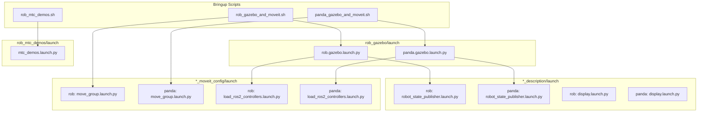
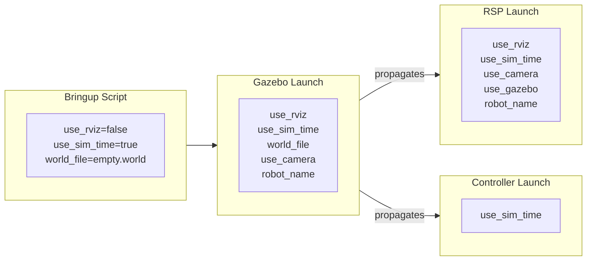

# Launch Flow

This document describes the launch file hierarchy, which nodes each file spawns, and how launch arguments propagate through the system.

## Launch Hierarchy Overview



---

## Bringup Scripts

Located in `src/robot_arm/rob_bringup/scripts/`

### rob_gazebo_and_moveit.sh

Launches the complete Rob robot simulation with motion planning.

**Execution order:**
1. `ros2 launch rob_gazebo rob.gazebo.launch.py` (background)
2. Wait 15 seconds for Gazebo to initialize
3. `ros2 launch rob_moveit_config move_group.launch.py` (background)
4. Adjust Gazebo camera position

**Key arguments passed:**
- `load_controllers:=true`
- `world_file:=empty.world`
- `use_camera:=false`
- `use_rviz:=false`

### panda_gazebo_and_moveit.sh

Same as above but for the Panda robot, using `panda.gazebo.launch.py` and `panda_moveit_config`.

---

## Gazebo Launch Files

Located in `src/robot_arm/rob_gazebo/launch/`

### rob.gazebo.launch.py

**Purpose:** Launch Gazebo simulation with the Rob robot

**Nodes spawned:**
| Node | Package | Purpose |
|------|---------|---------|
| `ros_gz_sim` | ros_gz_sim | Gazebo simulator |
| `parameter_bridge` | ros_gz_bridge | ROS-Gazebo topic bridge |
| `image_bridge` | ros_gz_image | Camera image bridge |
| `create` | ros_gz_sim | Robot spawner |

**Included launch files:**
- `rob_description/launch/robot_state_publisher.launch.py`
- `rob_moveit_config/launch/load_ros2_controllers.launch.py`

**Key arguments:**

| Argument | Default | Description |
|----------|---------|-------------|
| `robot_name` | `rob` | Name of the robot |
| `world_file` | `pick_and_place_demo.world` | Gazebo world to load |
| `use_rviz` | `true` | Launch RViz |
| `use_sim_time` | `true` | Use simulation time |
| `use_camera` | `false` | Enable RGBD camera |
| `load_controllers` | `true` | Load ros2_control controllers |
| `x`, `y`, `z` | `0.0, 0.0, 0.1` | Robot spawn position |
| `roll`, `pitch`, `yaw` | `0.0` | Robot spawn orientation |

### panda.gazebo.launch.py

Same structure as `rob.gazebo.launch.py` but references:
- `panda_description` for robot model
- `panda_moveit_config` for controllers

---

## Description Launch Files

### robot_state_publisher.launch.py (Advanced Version)

Located in `bb01_description/launch/` and similar in `panda_description/launch/`

**Purpose:** Publish robot state and optionally start visualization

**Nodes spawned:**
| Node | Package | Condition |
|------|---------|-----------|
| `robot_state_publisher` | robot_state_publisher | Always |
| `joint_state_publisher` | joint_state_publisher | If `use_gazebo=false` and `jsp_gui=false` |
| `joint_state_publisher_gui` | joint_state_publisher_gui | If `use_gazebo=false` and `jsp_gui=true` |
| `rviz2` | rviz2 | If `use_rviz=true` |

**Key arguments:**

| Argument | Default | Description |
|----------|---------|-------------|
| `robot_name` | `panda` | Robot name for xacro |
| `add_world` | `true` | Add world link to URDF |
| `use_camera` | `false` | Include camera in URDF |
| `use_gazebo` | `false` | Configure for Gazebo |
| `jsp_gui` | `true` | Use GUI joint publisher |
| `use_rviz` | `true` | Launch RViz |
| `use_sim_time` | `false` | Use simulation time |
| `urdf_model` | (auto) | Path to URDF file |

### display.launch.py (Simple Version)

Located in `rob_description/launch/` and `panda_description/launch/`

**Purpose:** Simple robot visualization in RViz

**Nodes spawned:**
- `robot_state_publisher`
- `joint_state_publisher_gui`
- `rviz2`

**Key arguments:**

| Argument | Default | Description |
|----------|---------|-------------|
| `model` | `<package>/urdf/<robot>.urdf.xacro` | URDF path |

---

## MoveIt Launch Files

### move_group.launch.py

Located in `rob_moveit_config/launch/` and `panda_moveit_config/launch/`

**Purpose:** Start the MoveIt move_group node for motion planning

**Nodes spawned:**
| Node | Package | Purpose |
|------|---------|---------|
| `move_group` | moveit_ros_move_group | Motion planning server |
| `rviz2` | rviz2 | MoveIt RViz (if enabled) |

**MoveIt Configuration loaded:**
- Kinematics solver (KDL)
- Planning pipelines (OMPL, Pilz, STOMP)
- Controller configuration
- Joint limits
- SRDF (semantic robot description)

**Key arguments:**

| Argument | Default | Description |
|----------|---------|-------------|
| `robot_name` | `rob`/`panda` | Robot name |
| `use_sim_time` | `true` | Use simulation time |
| `use_rviz` | `true` | Launch MoveIt RViz |
| `rviz_config_file` | `move_group.rviz` | RViz config |

### load_ros2_controllers.launch.py

**Purpose:** Spawn ros2_control controllers

**Controllers loaded:**
- `joint_state_broadcaster` - Publishes joint states
- `joint_trajectory_controller` - Arm trajectory execution
- `gripper_controller` - Gripper control (if applicable)

---

## MTC Demo Launch Files

### mtc_demos.launch.py

Located in `src/robot_arm/rob_mtc_demos/launch/`

**Purpose:** Run MoveIt Task Constructor demonstrations

**Nodes spawned:**
| Node | Package | Purpose |
|------|---------|---------|
| MTC demo node | rob_mtc_demos | Execute selected demo |

**Key arguments:**

| Argument | Default | Description |
|----------|---------|-------------|
| `robot_name` | `rob` | Robot name |
| `use_sim_time` | `true` | Use simulation time |
| `exe` | `alternative_path_costs` | Demo executable |

**Available demos:**
- `alternative_path_costs`
- `cartesian`
- `fallbacks_move_to`
- `ik_clearance_cost`
- `modular`

---

## Launch Argument Propagation



---

## Current Architecture Issues

The current launch file architecture has significant code duplication:

1. **Duplicate launch files per robot:**
   - `rob.gazebo.launch.py` vs `panda.gazebo.launch.py` (nearly identical)
   - `rob_moveit_config/move_group.launch.py` vs `panda_moveit_config/move_group.launch.py`

2. **Hardcoded package names:**
   ```python
   # Current (hardcoded)
   package_name_description = 'rob_description'
   
   # Target (parametric)
   package_name_description = LaunchConfiguration('robot') + '_description'
   ```

3. **Separate description packages:**
   - Each robot has its own `*_description` package
   - Same launch file structure duplicated

---

## Target Architecture (After Parametrization)

See [Parametrization Roadmap](../development/parametrization-roadmap.md) for the plan to consolidate these launch files.

**Goal:** Single parametric launch files that accept `robot:=<name>` argument

```bash
# Target usage
ros2 launch robot_gazebo simulation.launch.py robot:=rob
ros2 launch robot_gazebo simulation.launch.py robot:=panda
ros2 launch robot_gazebo simulation.launch.py robot:=bb01
```

---

## Common Launch Commands

### Full Simulation (Gazebo + MoveIt)

```bash
# Rob robot
ros2 launch rob_gazebo rob.gazebo.launch.py
ros2 launch rob_moveit_config move_group.launch.py

# Panda robot
ros2 launch rob_gazebo panda.gazebo.launch.py
ros2 launch panda_moveit_config move_group.launch.py
```

### Visualization Only (No Simulation)

```bash
ros2 launch rob_description display.launch.py
ros2 launch panda_description display.launch.py
```

### With Custom World

```bash
ros2 launch rob_gazebo rob.gazebo.launch.py world_file:=house.world
```

### Without RViz

```bash
ros2 launch rob_gazebo rob.gazebo.launch.py use_rviz:=false
```
