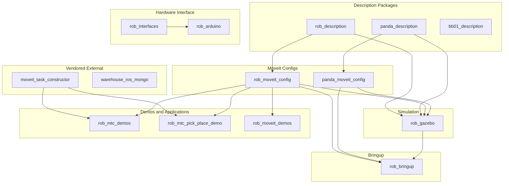
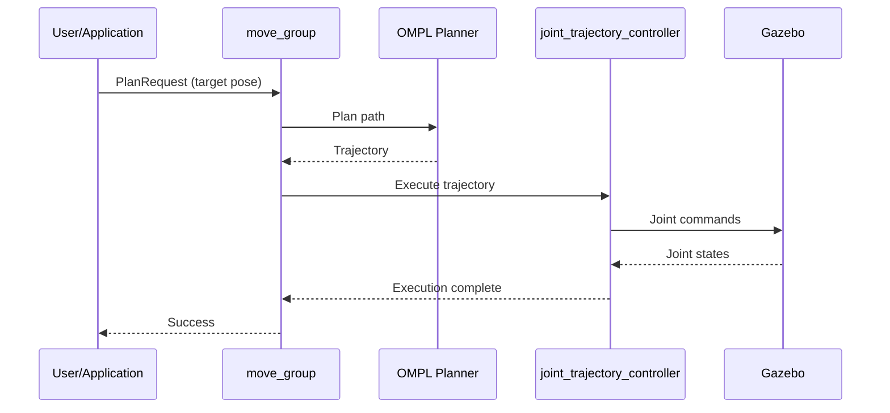

# Package Relationships

This document describes the dependencies and data flow between packages in the MECH490 Capstone project.

## Package Dependency Graph



## Dependency Details

### panda_description
**Depends on:** None (root package)
**Used by:** `panda_moveit_config`, `rob_gazebo`

Provides the Panda robot URDF, meshes, and basic visualization.

### rob_description
**Depends on:** None (root package)
**Used by:** `rob_moveit_config`, `rob_gazebo`

Provides the Rob (Moveo) robot URDF, meshes, and basic visualization.

### bb01_description
**Depends on:** None (root package)
**Used by:** (Future: bb01_moveit_config, rob_gazebo)

Provides the BB01 robot URDF, meshes. Currently under construction.

### panda_moveit_config
**Depends on:** `panda_description`
**Used by:** `rob_gazebo`, `rob_bringup`

MoveIt configuration for the Panda robot including kinematics, controllers, and planning pipelines.

### rob_moveit_config
**Depends on:** `rob_description`
**Used by:** `rob_gazebo`, `rob_bringup`, `rob_mtc_demos`, `rob_mtc_pick_place_demo`

MoveIt configuration for the Rob robot.

### rob_gazebo
**Depends on:** `panda_description`, `rob_description`, `panda_moveit_config`, `rob_moveit_config`
**Used by:** `rob_bringup`

Simulation environment for all robots.

### rob_mtc_demos
**Depends on:** `rob_moveit_config`, `moveit_task_constructor`
**Used by:** None (end application)

MoveIt Task Constructor demonstration nodes.

---

## ROS Topic Connections

```mermaid
flowchart LR
    subgraph nodes [Key Nodes]
        rsp[robot_state_publisher]
        jsp[joint_state_publisher_gui]
        gz[Gazebo]
        mg[move_group]
        cm[controller_manager]
    end
    
    subgraph topics [Key Topics]
        rd[/robot_description]
        js[/joint_states]
        tf[/tf]
        tfs[/tf_static]
        traj[/joint_trajectory_controller/joint_trajectory]
    end
    
    rsp -->|pub| rd
    rsp -->|pub| tf
    rsp -->|pub| tfs
    rsp -->|sub| js
    
    jsp -->|pub| js
    gz -->|pub| js
    
    mg -->|sub| rd
    mg -->|sub| js
    mg -->|pub| traj
    
    cm -->|sub| traj
```

### Topic Descriptions

| Topic | Type | Publishers | Subscribers |
|-------|------|------------|-------------|
| `/robot_description` | `std_msgs/String` | robot_state_publisher | move_group, RViz |
| `/joint_states` | `sensor_msgs/JointState` | Gazebo / joint_state_publisher | robot_state_publisher, move_group |
| `/tf` | `tf2_msgs/TFMessage` | robot_state_publisher | move_group, RViz |
| `/tf_static` | `tf2_msgs/TFMessage` | robot_state_publisher | move_group, RViz |

---

## TF Tree Structure

### Rob Robot TF Tree

```
world
└── base_link
    └── link1
        └── link2
            └── link3
                └── link4
                    └── link5
                        ├── virtual_link6_tip
                        ├── link_L_gear
                        │   └── link_L_arm
                        ├── link_R_gear
                        │   └── link_R_arm
                        ├── link_L_pivot
                        └── link_R_pivot
```

### Panda Robot TF Tree

```
world
└── panda_link0
    └── panda_link1
        └── panda_link2
            └── panda_link3
                └── panda_link4
                    └── panda_link5
                        └── panda_link6
                            └── panda_link7
                                └── panda_link8
                                    └── panda_hand
                                        ├── panda_leftfinger
                                        └── panda_rightfinger
```

---

## Controller Manager Architecture

```mermaid
flowchart TB
    subgraph hw_interface [Hardware Interface]
        gz_hw[GazeboSimSystem]
        real_hw[ArduinoHardware]
    end
    
    subgraph cm [Controller Manager]
        jsb[joint_state_broadcaster]
        jtc[joint_trajectory_controller]
        gc[gripper_controller]
    end
    
    subgraph moveit [MoveIt]
        mg[move_group]
        mc[MoveIt Controllers]
    end
    
    gz_hw --> cm
    real_hw --> cm
    
    jsb --> js[/joint_states]
    mg --> mc
    mc --> jtc
    jtc --> hw_interface
```

### Controllers

| Controller | Type | Purpose |
|------------|------|---------|
| `joint_state_broadcaster` | Broadcaster | Publishes joint states to `/joint_states` |
| `joint_trajectory_controller` | Position | Executes arm trajectories |
| `gripper_controller` | Position | Controls gripper fingers |

---

## Data Flow: Motion Planning Request



---

## Package.xml Dependencies

### Common Dependencies (Most Packages)

```xml
<depend>rclcpp</depend>
<depend>rclpy</depend>
<depend>std_msgs</depend>
<depend>sensor_msgs</depend>
<depend>geometry_msgs</depend>
```

### Description Package Dependencies

```xml
<exec_depend>robot_state_publisher</exec_depend>
<exec_depend>joint_state_publisher</exec_depend>
<exec_depend>joint_state_publisher_gui</exec_depend>
<exec_depend>rviz2</exec_depend>
<exec_depend>xacro</exec_depend>
```

### MoveIt Config Dependencies

```xml
<depend>moveit_ros_planning</depend>
<depend>moveit_ros_move_group</depend>
<depend>moveit_kinematics</depend>
<depend>moveit_planners_ompl</depend>
<depend>moveit_configs_utils</depend>
```

### Gazebo Dependencies

```xml
<depend>ros_gz_sim</depend>
<depend>ros_gz_bridge</depend>
<depend>ros_gz_image</depend>
<depend>gz_ros2_control</depend>
```

---

## Next Steps

- [Launch Flow](launch-flow.md) - Understand how launch files orchestrate these packages
