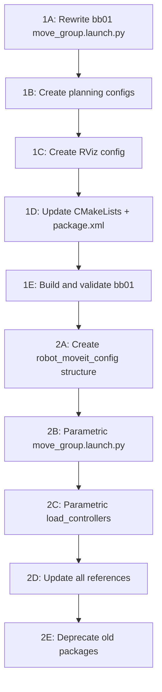

# BB01 MoveIt Launch and Parametric MoveIt Config

## Current State

What is already parametric and working:

- `robot_description` -- consolidated, serves all 3 robots via `robot:=<name>`
- `simulation.launch.py` in `rob_gazebo` -- unified Gazebo launch
- Bringup scripts (`gazebo_and_moveit.sh`, etc.) -- already accept robot arg

What is NOT ready:

- **bb01_moveit_config** was auto-generated by MoveIt Setup Assistant and is essentially non-functional for Gazebo simulation. Its `move_group.launch.py` is a one-liner with no `use_sim_time`, no RViz config args, no MTC capability, and no explicit planning pipelines.
- MoveIt configs are still 3 separate packages (`rob_moveit_config`, `panda_moveit_config`, `bb01_moveit_config`) with duplicated launch logic.

## Gap Analysis: bb01 vs rob (reference)

| Feature | rob_moveit_config | bb01_moveit_config |

|---|---|---|

| `move_group.launch.py` | Full custom with MoveItConfigsBuilder, configurable rviz, MTC capability | One-liner `generate_move_group_launch` |

| OMPL planning config | `ompl_planning.yaml` (229 lines) | Missing |

| STOMP planning config | `stomp_planning.yaml` | Missing |

| Pilz planner config | `pilz_industrial_motion_planner_planning.yaml` | Missing |

| RViz config | `rviz/move_group.rviz` (full MoveIt panel) | `config/moveit.rviz` (minimal, wrong dir) |

| CMakeLists.txt | Installs `config/`, `launch/`, `rviz/` | Only installs `config/`, `launch/` |

| `use_sim_time` support | Yes, piped to move_group + rviz | No |

| MTC capability | `ExecuteTaskSolutionCapability` | No |

---

## Phase 1: Get bb01 MoveIt Fully Working (Priority)

Modeled entirely after [rob_moveit_config/launch/move_group.launch.py](src/robot_arm/rob_moveit_config/launch/move_group.launch.py).

### 1A -- Rewrite bb01 `move_group.launch.py`

Replace the auto-generated one-liner in [bb01_moveit_config/launch/move_group.launch.py](src/robot_arm/bb01_moveit_config/launch/move_group.launch.py) with a full launch file matching rob's structure:

- Declare `use_sim_time`, `use_rviz`, `rviz_config_file`, `rviz_config_package`, `robot_name` args
- Use `MoveItConfigsBuilder("bb01", package_name="bb01_moveit_config")` with explicit file paths for SRDF, kinematics, joint limits, moveit controllers, pilz cartesian limits
- Configure planning pipelines: `["ompl", "pilz_industrial_motion_planner", "stomp"]`
- Add MTC capability: `ExecuteTaskSolutionCapability`
- Add RViz node with moveit config params + rviz exit handler
- Use OpaqueFunction pattern for runtime config

### 1B -- Create missing planning pipeline configs

Create these files in `bb01_moveit_config/config/`, adapted for bb01 (group "arm" with joints `joint_1` through `joint_6`, no gripper groups):

1. **`ompl_planning.yaml`** -- copy from rob, replace `arm_with_gripper` references, keep only `arm` group
2. **`stomp_planning.yaml`** -- copy from rob as-is (robot-agnostic)
3. **`pilz_industrial_motion_planner_planning.yaml`** -- copy from rob as-is (robot-agnostic)

### 1C -- Create proper RViz config

1. Create `bb01_moveit_config/rviz/` directory
2. Create `rviz/move_group.rviz` based on [rob_moveit_config/rviz/move_group.rviz](src/robot_arm/rob_moveit_config/rviz/move_group.rviz), adapted for bb01 (fixed frame = `world`)

### 1D -- Update build/package files

1. Update [bb01_moveit_config/CMakeLists.txt](src/robot_arm/bb01_moveit_config/CMakeLists.txt):

   - Add `find_package` for moveit dependencies (matching rob)
   - Add `rviz` to the install directories

2. Update [bb01_moveit_config/package.xml](src/robot_arm/bb01_moveit_config/package.xml):

   - Add `moveit_planners_ompl`, `pilz_industrial_motion_planner`, `rviz_visual_tools` dependencies

### 1E -- Validate bb01 MoveIt launch

```bash
# Test 1: Gazebo + MoveIt (via bringup script)
./gazebo_and_moveit.sh bb01

# Test 2: Direct launch
ros2 launch robot_gazebo simulation.launch.py robot:=bb01
ros2 launch bb01_moveit_config move_group.launch.py
```

---

## Phase 2: Parametric MoveIt Config Consolidation

After bb01 is working, consolidate all MoveIt configs into a single `robot_moveit_config` package per the existing roadmap in [parametrization-roadmap.md](docs/development/Sprints/Sprint 1 Jan 20 2026/parametrization-roadmap.md).

### 2A -- Create unified package structure

```
robot_moveit_config/
  robots/
    panda/config/   (move panda_moveit_config/config/* here)
    rob/config/     (move rob_moveit_config/config/* here)
    bb01/config/    (move bb01_moveit_config/config/* here)
  launch/
    move_group.launch.py          (parametric, robot:=<name>)
    load_ros2_controllers.launch.py  (parametric, robot:=<name>)
  rviz/
    move_group.rviz   (shared or per-robot)
  CMakeLists.txt
  package.xml
```

### 2B -- Create parametric `move_group.launch.py`

Single launch file using `robot:=<name>` argument that:

- Resolves config paths to `robots/<robot>/config/`
- Handles robot-specific differences (e.g., rob has gripper, bb01 does not)
- Uses `OpaqueFunction` pattern (same as `simulation.launch.py`)

### 2C -- Create parametric `load_ros2_controllers.launch.py`

Handle robot-specific controller sets:

- rob: joint_state_broadcaster -> arm_controller -> gripper_action_controller
- bb01: joint_state_broadcaster -> arm_controller (no gripper)
- panda: joint_state_broadcaster -> arm_controller -> hand_controller

### 2D -- Update all references

- Update `gazebo_sim_ros2_control.urdf.xacro` for each robot to reference `robot_moveit_config` instead of `<robot>_moveit_config`
- Update `simulation.launch.py` ROBOT_CONFIGS to use `robot_moveit_config`
- Update bringup scripts: `ros2 launch robot_moveit_config move_group.launch.py robot:=$ROBOT`

### 2E -- Deprecate old packages

Keep `bb01_moveit_config`, `rob_moveit_config`, `panda_moveit_config` during transition. Remove after validation.

---

## Execution Order

