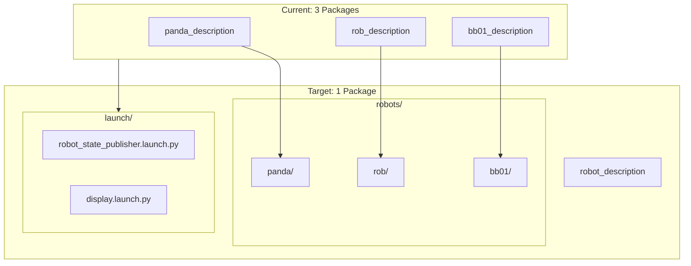

# Parametrization Sprint 1 - Package Consolidation

**Sprint Dates:** January 20-24, 2026

**Primary Goal:** Consolidate description packages and Gazebo launch files into parametric architecture

---

## Current State Analysis

The repository has significant code duplication across three nearly identical packages:

| Package | URDF | Meshes | Launch Files |

|---------|------|--------|--------------|

| `panda_description` | `panda.urdf.xacro` | 20 files (visual/collision) | 3 identical |

| `rob_description` | `rob.urdf.xacro` | 14 files + d435 sensor | 3 identical |

| `bb01_description` | `BB01_URDF.urdf.xacro` | 7 STL files | 3 identical |

**Key Issues Found:**

1. Launch files are 95% identical - only package/filename constants differ
2. BB01 URDF has broken mesh paths (references `BB01_URDF` instead of `bb01_description`)
3. Hardcoded paths in launch files (e.g., `~/robot_arm/src/...`) are fragile
4. No MoveIt config exists for BB01 yet

---

## Sprint Architecture



---

## Phase 1: Description Package Consolidation (Days 1-2)

### 1.1 Create Package Structure

Create [`src/robot_arm/robot_description/`](src/robot_arm/robot_description/) with:

```
robot_description/
├── package.xml
├── CMakeLists.txt
├── robots/
│   ├── panda/
│   │   ├── urdf/
│   │   │   ├── panda.urdf.xacro
│   │   │   └── control/
│   │   └── meshes/
│   │       ├── visual/
│   │       └── collision/
│   ├── rob/
│   │   ├── urdf/
│   │   │   ├── rob.urdf.xacro
│   │   │   ├── control/
│   │   │   └── sensors/
│   │   └── meshes/
│   └── bb01/
│       ├── urdf/
│       └── meshes/
├── launch/
│   ├── robot_state_publisher.launch.py
│   ├── display.launch.py
│   └── gazebo.launch.py
└── rviz/
    └── display.rviz
```

### 1.2 Update Mesh Paths in URDFs

**Before** ([rob_description/urdf/rob.urdf.xacro](src/robot_arm/rob_description/urdf/rob.urdf.xacro)):

```xml
<mesh filename="package://rob_description/meshes/base_link.stl" />
```

**After:**

```xml
<mesh filename="package://robot_description/robots/rob/meshes/base_link.stl" />
```

### 1.3 Create Parametric Launch File

Key changes from current [`robot_state_publisher.launch.py`](src/robot_arm/bb01_description/launch/robot_state_publisher.launch.py):

```python
# Add robot selection argument
robot_arg = DeclareLaunchArgument(
    'robot',
    default_value='rob',
    choices=['panda', 'rob', 'bb01'],
    description='Robot to load'
)

# Dynamic path resolution
def configure_launch(context):
    robot = LaunchConfiguration('robot').perform(context)
    pkg_share = get_package_share_directory('robot_description')
    urdf_file = os.path.join(pkg_share, 'robots', robot, 'urdf', f'{robot}.urdf.xacro')
    # ...
```

### 1.4 Fix BB01 Issues

- Rename `BB01_URDF.urdf.xacro` to `bb01.urdf.xacro` for consistency
- Fix mesh paths from `package://BB01_URDF/...` to correct paths
- Add ros2_control integration (optional for this sprint)

---

## Phase 2: Gazebo Consolidation (Day 3)

### 2.1 Create Unified Simulation Launch

Consolidate [`rob.gazebo.launch.py`](src/robot_arm/rob_gazebo/launch/rob.gazebo.launch.py) and [`panda.gazebo.launch.py`](src/robot_arm/rob_gazebo/launch/panda.gazebo.launch.py) into single `simulation.launch.py`:

```python
ROBOT_CONFIGS = {
    'panda': {'moveit_package': 'panda_moveit_config'},
    'rob': {'moveit_package': 'rob_moveit_config'},
    'bb01': {'moveit_package': None},  # No MoveIt config yet
}

def generate_launch_description():
    robot_arg = DeclareLaunchArgument(
        'robot', default_value='rob',
        choices=list(ROBOT_CONFIGS.keys())
    )
    # Use OpaqueFunction to resolve config at runtime
```

### 2.2 Rename Package

- Rename `rob_gazebo` to `robot_gazebo` (optional, can keep as is)
- Update all references in bringup scripts

---

## Phase 3: Bringup Script Updates (Day 4)

### 3.1 Update Shell Scripts

Modify [`rob_bringup/scripts/`](src/robot_arm/rob_bringup/scripts/):

**Before:**

```bash
ros2 launch rob_gazebo rob.gazebo.launch.py
ros2 launch rob_moveit_config move_group.launch.py
```

**After:**

```bash
ROBOT=${1:-rob}
ros2 launch robot_gazebo simulation.launch.py robot:=$ROBOT
ros2 launch robot_moveit_config move_group.launch.py robot:=$ROBOT
```

### 3.2 Update run_script.sh

Add robot selection to [`run_script.sh`](run_script.sh) interactive menu.

---

## Phase 4: Documentation and Cleanup (Day 5)

### 4.1 Sprint Documentation

Create sprint documentation at:

```
docs/development/sprints/sprint-1/2026-01-20/
├── README.md          # Sprint overview and outcomes
├── changes.md         # Detailed change log
└── migration-guide.md # How to use new architecture
```

### 4.2 Update Existing Docs

- Update [`parametrization-roadmap.md`](docs/development/parametrization-roadmap.md) with sprint link
- Update [`launch-flow.md`](docs/architecture/launch-flow.md) with new architecture
- Mark Phase 1 and Phase 2 as complete in roadmap

### 4.3 Validation

Test all robots:

```bash
ros2 launch robot_description robot_state_publisher.launch.py robot:=panda
ros2 launch robot_description robot_state_publisher.launch.py robot:=rob
ros2 launch robot_description robot_state_publisher.launch.py robot:=bb01
```

---

## Files to Modify/Create

### New Files

- `src/robot_arm/robot_description/` (entire package)
- `docs/development/sprints/sprint-1/2026-01-20/README.md`

### Modified Files

- [`src/robot_arm/rob_gazebo/launch/`](src/robot_arm/rob_gazebo/launch/) - consolidate
- [`src/robot_arm/rob_bringup/scripts/*.sh`](src/robot_arm/rob_bringup/scripts/)
- [`run_script.sh`](run_script.sh)
- [`docs/development/parametrization-roadmap.md`](docs/development/parametrization-roadmap.md)

### Deprecated (keep for rollback)

- `src/robot_arm/panda_description/`
- `src/robot_arm/rob_description/`
- `src/robot_arm/bb01_description/`

---

## Success Criteria

- [ ] Single `robot_description` package created
- [ ] `robot:=panda|rob|bb01` argument works for all launch files
- [ ] All three robots visualize correctly in RViz
- [ ] Gazebo simulation works with unified launch
- [ ] No regression in existing functionality
- [ ] Sprint documentation complete