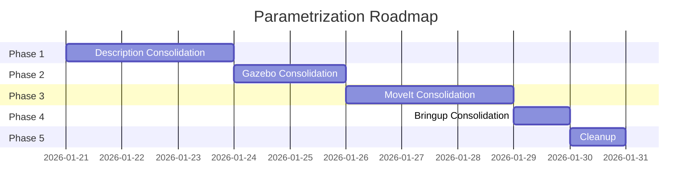

# Parametrization Roadmap

This document outlines the phased plan to consolidate duplicate packages and create a robot-agnostic architecture where adding a new robot requires only configuration files, not code duplication.

## Current Problem

The current architecture has significant code duplication:

```
Current Structure (Duplicated):
├── panda_description/          # Panda-specific
├── rob_description/            # Rob-specific  
├── bb01_description/           # BB01-specific
├── panda_moveit_config/        # Panda-specific
├── rob_moveit_config/          # Rob-specific
└── rob_gazebo/
    ├── panda.gazebo.launch.py  # Nearly identical
    └── rob.gazebo.launch.py    # Nearly identical
```

**Issues:**
1. Adding a new robot requires duplicating entire packages
2. Bug fixes must be applied to multiple files
3. Inconsistent behavior between robots
4. Maintenance burden increases with each robot

## Target Architecture

```
Target Structure (Parametric):
├── robot_description/          # Single package, multiple robots
│   ├── robots/
│   │   ├── panda/
│   │   │   ├── panda.urdf.xacro
│   │   │   └── meshes/
│   │   ├── rob/
│   │   │   ├── rob.urdf.xacro
│   │   │   └── meshes/
│   │   └── bb01/
│   │       ├── bb01.urdf.xacro
│   │       └── meshes/
│   └── launch/
│       └── robot_state_publisher.launch.py  # robot:=<name>
├── robot_moveit_config/        # Single package
│   ├── robots/
│   │   ├── panda/
│   │   │   └── config/
│   │   ├── rob/
│   │   │   └── config/
│   │   └── bb01/
│   │       └── config/
│   └── launch/
│       └── move_group.launch.py  # robot:=<name>
└── robot_gazebo/               # Single package
    └── launch/
        └── simulation.launch.py  # robot:=<name>
```

**Benefits:**
1. Single launch file works for all robots
2. Adding robot = adding config directory
3. Consistent behavior guaranteed
4. Easier maintenance

---

## Phase 1: Description Package Consolidation

**Priority:** High  
**Estimated Effort:** 2-3 days  
**Dependencies:** None

### Goal

Consolidate `panda_description`, `rob_description`, and `bb01_description` into a single `robot_description` package.

### Tasks

#### 1.1 Create New Package Structure

```bash
mkdir -p robot_description/robots/{panda,rob,bb01}
mkdir -p robot_description/launch
mkdir -p robot_description/rviz
```

#### 1.2 Move Robot-Specific Files

```bash
# For each robot
mv panda_description/urdf/* robot_description/robots/panda/
mv panda_description/meshes/* robot_description/robots/panda/meshes/
```

#### 1.3 Update Mesh Paths in URDFs

**Before:**
```xml
<mesh filename="package://panda_description/meshes/visual/link0.dae"/>
```

**After:**
```xml
<mesh filename="package://robot_description/robots/panda/meshes/visual/link0.dae"/>
```

#### 1.4 Create Parametric Launch File

```python
# robot_description/launch/robot_state_publisher.launch.py

def generate_launch_description():
    # Declare robot argument
    robot_arg = DeclareLaunchArgument(
        'robot',
        default_value='rob',
        choices=['panda', 'rob', 'bb01'],
        description='Robot to load'
    )
    
    robot = LaunchConfiguration('robot')
    
    # Build paths dynamically
    urdf_file = PathJoinSubstitution([
        FindPackageShare('robot_description'),
        'robots', robot, robot, '.urdf.xacro'
    ])
    
    # ... rest of launch file
```

#### 1.5 Update Dependencies

Update all packages that depend on `*_description` to use `robot_description`.

### Validation

```bash
# Test each robot
ros2 launch robot_description robot_state_publisher.launch.py robot:=panda
ros2 launch robot_description robot_state_publisher.launch.py robot:=rob
ros2 launch robot_description robot_state_publisher.launch.py robot:=bb01
```

### Rollback Plan

Keep original packages during transition. Only remove after full validation.

---

## Phase 2: Gazebo Package Consolidation

**Priority:** High  
**Estimated Effort:** 1-2 days  
**Dependencies:** Phase 1

### Goal

Consolidate `rob_gazebo` launch files into a single parametric launch file.

### Tasks

#### 2.1 Create Unified Launch File

**Before (two files):**
- `rob.gazebo.launch.py`
- `panda.gazebo.launch.py`

**After (one file):**
```python
# robot_gazebo/launch/simulation.launch.py

ROBOT_CONFIGS = {
    'panda': {
        'description_package': 'robot_description',
        'moveit_package': 'robot_moveit_config',
        'default_z': 0.0,
    },
    'rob': {
        'description_package': 'robot_description',
        'moveit_package': 'robot_moveit_config',
        'default_z': 0.0,
    },
    'bb01': {
        'description_package': 'robot_description',
        'moveit_package': 'robot_moveit_config',
        'default_z': 0.0,
    },
}

def generate_launch_description():
    robot_arg = DeclareLaunchArgument(
        'robot',
        default_value='rob',
        choices=list(ROBOT_CONFIGS.keys()),
        description='Robot to simulate'
    )
    
    # Use OpaqueFunction to resolve robot at runtime
    def configure_launch(context):
        robot = LaunchConfiguration('robot').perform(context)
        config = ROBOT_CONFIGS[robot]
        # ... build launch description
```

#### 2.2 Update Bringup Scripts

```bash
# Before
ros2 launch rob_gazebo rob.gazebo.launch.py

# After
ros2 launch robot_gazebo simulation.launch.py robot:=rob
```

### Validation

```bash
ros2 launch robot_gazebo simulation.launch.py robot:=panda world_file:=empty.world
ros2 launch robot_gazebo simulation.launch.py robot:=rob world_file:=empty.world
```

---

## Phase 3: MoveIt Config Consolidation ✅ COMPLETE

**Priority:** Medium  
**Estimated Effort:** 2-3 days  
**Dependencies:** Phase 1, Phase 2  
**Status:** ✅ Completed February 2026

### Goal

Consolidate `panda_moveit_config` and `rob_moveit_config` into `robot_moveit_config`.

### Challenges

MoveIt configs have robot-specific:
- SRDF (planning groups, end effectors)
- Kinematics solver parameters
- Controller configurations
- Joint limits

### Tasks

#### 3.1 Create Config Directory Structure

```
robot_moveit_config/
├── robots/
│   ├── panda/
│   │   └── config/
│   │       ├── panda.srdf
│   │       ├── kinematics.yaml
│   │       ├── joint_limits.yaml
│   │       └── ...
│   └── rob/
│       └── config/
│           ├── rob.srdf
│           └── ...
├── launch/
│   └── move_group.launch.py
└── rviz/
    └── move_group.rviz
```

#### 3.2 Update MoveItConfigsBuilder Usage

```python
def configure_setup(context):
    robot = LaunchConfiguration('robot').perform(context)
    
    config_path = os.path.join(
        pkg_share, 'robots', robot, 'config'
    )
    
    moveit_config = (
        MoveItConfigsBuilder(robot, package_name='robot_moveit_config')
        .robot_description_semantic(
            file_path=os.path.join(config_path, f'{robot}.srdf')
        )
        .joint_limits(
            file_path=os.path.join(config_path, 'joint_limits.yaml')
        )
        # ... other configs
        .to_moveit_configs()
    )
```

### Validation ✅

```bash
# All robots validated and working
ros2 launch robot_moveit_config move_group.launch.py robot:=panda
ros2 launch robot_moveit_config move_group.launch.py robot:=rob
ros2 launch robot_moveit_config move_group.launch.py robot:=bb01

# Unified simulation launch also works
ros2 launch robot_gazebo simulation.launch.py robot:=bb01
ros2 launch robot_gazebo simulation.launch.py robot:=rob
ros2 launch robot_gazebo simulation.launch.py robot:=panda
```

**Implementation Notes:**
- Created `robot_moveit_config/robots/{panda,rob,bb01}/config/` structure
- Parametric `move_group.launch.py` with `robot:=` argument
- Parametric `load_ros2_controllers.launch.py` with robot-specific controller sequences
- Updated `simulation.launch.py` to use unified `robot_moveit_config`
- Fixed launch file sequencing (Gazebo → bridge → spawn → controllers)
- All robots tested and working correctly

---

## Phase 4: Bringup and Demo Consolidation

**Priority:** Low  
**Estimated Effort:** 1 day  
**Dependencies:** Phases 1-3

### Goal

Update `rob_bringup` scripts and demo packages to be robot-agnostic.

### Tasks

#### 4.1 Update Bringup Scripts

**Before:**
```bash
# rob_gazebo_and_moveit.sh
ros2 launch rob_gazebo rob.gazebo.launch.py
ros2 launch rob_moveit_config move_group.launch.py
```

**After:**
```bash
# simulation_and_moveit.sh
ROBOT=${1:-rob}
ros2 launch robot_gazebo simulation.launch.py robot:=$ROBOT
ros2 launch robot_moveit_config move_group.launch.py robot:=$ROBOT
```

#### 4.2 Update MTC Demos

```python
# mtc_demos.launch.py
robot_arg = DeclareLaunchArgument(
    'robot',
    default_value='rob',
    description='Robot to use for demos'
)
```

#### 4.3 Update run_script.sh

Add robot selection to the interactive launcher.

---

## Phase 5: Package Cleanup

**Priority:** Low  
**Estimated Effort:** 1 day  
**Dependencies:** Phases 1-4 fully validated

### Tasks

1. Remove deprecated packages:
   - `panda_description` (replaced by `robot_description`)
   - `rob_description` (replaced by `robot_description`)
   - `bb01_description` (replaced by `robot_description`)
   - `panda_moveit_config` (replaced by `robot_moveit_config`)
   - `rob_moveit_config` (replaced by `robot_moveit_config`)

2. Rename packages if desired:
   - `rob_gazebo` → `robot_gazebo`
   - `rob_bringup` → `robot_bringup`

3. Update all documentation

---

## Implementation Timeline



**Estimated Total:** 10-12 working days

---

## Migration Strategy

### Parallel Development

1. Create new packages alongside existing ones
2. Both architectures work simultaneously
3. Gradually migrate robots to new structure
4. Remove old packages only after full validation

### Testing Protocol

For each phase:
1. Unit tests for launch files
2. Integration tests (robot loads, moves)
3. Regression tests (existing functionality preserved)
4. Documentation updates

### Breaking Changes

| Change | Impact | Mitigation |
|--------|--------|------------|
| Package rename | External dependencies | Provide compatibility layer |
| Launch file changes | Scripts, CI/CD | Update all references |
| Config path changes | MoveIt configs | Test thoroughly |

---

## Success Criteria

Phase 1 Complete:
- [ ] Single `robot_description` package
- [ ] All three robots visualize correctly
- [ ] No duplicate URDF code

Phase 2 Complete:
- [ ] Single Gazebo launch file
- [ ] All robots simulate correctly
- [ ] World selection works for all robots

Phase 3 Complete: ✅
- [x] Single MoveIt config package (`robot_moveit_config`)
- [x] Motion planning works for all robots (panda, rob, bb01)
- [x] Controllers load correctly via parametric launcher
- [x] Unified launch files with `robot:=` argument
- [x] All references updated (simulation.launch.py, bringup scripts)

Phase 4 Complete:
- [ ] Robot-agnostic bringup scripts
- [ ] MTC demos work for all robots
- [ ] run_script.sh updated

Phase 5 Complete:
- [ ] Old packages removed
- [ ] Documentation updated
- [ ] CI/CD updated

---

## Related Documentation

- [Project Overview](../architecture/project-overview.md)
- [Launch Flow](../architecture/launch-flow.md) - Current architecture details
- [Adding a New Robot](adding-new-robot.md) - Process for new robots
