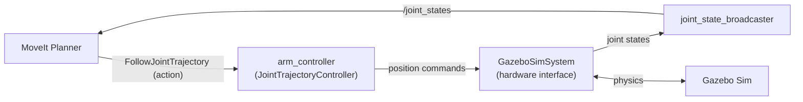
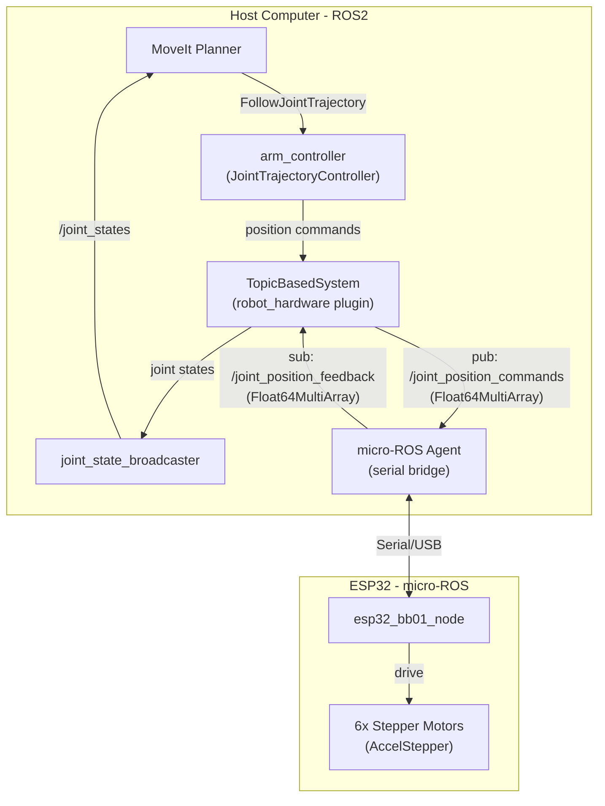
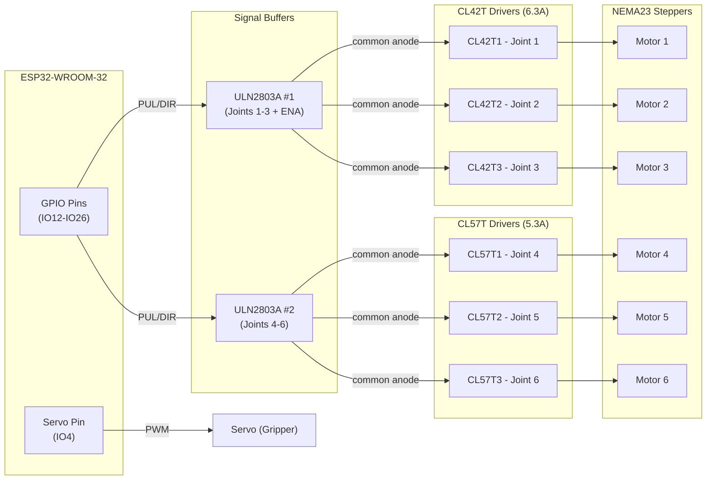

# Arduino Hardware Integration: MoveIt to ESP32 via micro-ROS

## Current State

Your simulation pipeline works like this:



The key insight: **the only thing that needs to change is the hardware interface plugin**. Everything above it (MoveIt, arm_controller, joint_state_broadcaster) stays the same. You swap `gz_ros2_control/GazeboSimSystem` for a custom plugin that talks to ESP32 via topics.

## Target Architecture



## Hardware Layer



### Signal Path (Common Anode)

The stepper drivers (CL42T / CL57T) are wired in **common anode** configuration:

- `PUL+`, `DIR+`, `ENA+` are tied to **+5V**
- The **ULN2803A** (open-collector Darlington array) sinks `PUL-`, `DIR-`, `ENA-` to GND when activated
- ESP32 GPIO HIGH -> ULN2803A output LOW (sinks current) -> driver sees active pulse
- This means the logic is inverted through the buffer, but the common anode wiring compensates

AccelStepper operates in **DRIVER mode (mode 1, 2-wire)**: step pin + direction pin per motor. The ULN2803A handles the level shifting and current sinking transparently.

### Pin Mapping (from schematic)

**ESP32 -> ULN2803A #1 -> CL42T Drivers (Joints 1-3):**

| ESP32 GPIO | ULN2803A Pin | Signal | Driver |

|------------|-------------|--------|--------|

| IO12 | IN1 -> OUT18 | PUL- | CL42T1 (Joint 1 Step) |

| IO13 | IN2 -> OUT17 | DIR- | CL42T1 (Joint 1 Dir) |

| IO14 | IN3 -> OUT16 | PUL- | CL42T2 (Joint 2 Step) |

| IO15 | IN4 -> OUT15 | DIR- | CL42T2 (Joint 2 Dir) |

| IO16 | IN5 -> OUT14 | ENA- | Shared Enable (all 6 drivers) |

| IO17 | IN6 -> OUT13 | PUL- | CL42T3 (Joint 3 Step) |

| IO18 | IN7 -> OUT12 | DIR- | CL42T3 (Joint 3 Dir) |

**ESP32 -> ULN2803A #2 -> CL57T Drivers (Joints 4-6):**

| ESP32 GPIO | ULN2803A Pin | Signal | Driver |

|------------|-------------|--------|--------|

| IO19 | IN1 -> OUT18 | PUL- | CL57T1 (Joint 4 Step) |

| IO21 | IN2 -> OUT17 | DIR- | CL57T1 (Joint 4 Dir) |

| IO22 | IN3 -> OUT16 | PUL- | CL57T2 (Joint 5 Step) |

| IO23 | IN4 -> OUT15 | DIR- | CL57T2 (Joint 5 Dir) |

| IO25 | IN5 -> OUT14 | PUL- | CL57T3 (Joint 6 Step) |

| IO26 | IN6 -> OUT13 | DIR- | CL57T3 (Joint 6 Dir) |

**Other pins:**

| ESP32 GPIO | Function |

|------------|----------|

| IO4 | Servo (Gripper) |

| IO2 | Status LED |

---

## Phased Development

### Phase 1: ESP32 Firmware and micro-ROS Validation (Start Here)

**Goal**: Prove we can send and receive `Float64MultiArray` between the host and ESP32 reliably.

#### 1a. Rename `rob_interfaces` to `robot_interfaces`

Rename the package directory and update `package.xml` / `CMakeLists.txt` internally. No other packages currently depend on it, so this is a clean rename. Any custom messages for hardware communication (if needed later) will live here.

#### 1b. Create BB01 ESP32 Firmware

Create [`robot_esp32/Controller Code/BB01_Controller/BB01_Controller.ino`](robot_esp32/Controller Code/BB01_Controller/BB01_Controller.ino)(robot_esp32/Controller Code/BB01_Controller/BB01_Controller.ino)(robot_esp32/Controller Code/BB01_Controller/BB01_Controller.ino)(src/robot_arm/robot_esp32/Controller Code/BB01_Controller/BB01_Controller.ino), expanding on the [`ROS_Multi_Test.ino`](ROS_Multi_Test.ino)(src/robot_arm/robot_esp32/Controller Code/ROS_Multi_Test/ROS_Multi_Test.ino) pattern:

- **Single micro-ROS subscriber** on `/joint_position_commands` (`std_msgs/msg/Float64MultiArray`)
- Pre-allocate the `Float64MultiArray` data buffer for 6 elements (critical for micro-ROS memory safety)
- Receives 6 joint positions in **radians**
- Converts radians to steps using per-joint `steps_per_degree` and gear ratio constants
- **AccelStepper in DRIVER mode (mode 1, 2-wire step/dir)** -- not FULL4WIRE as in the existing test code
- Drives 6 `AccelStepper` instances through **ULN2803A** Darlington buffers in **common anode** wiring
- Shared **enable pin** (IO16) to activate/deactivate all drivers
- **Servo** on IO4 for gripper control (separate topic or later phase)
- LED blinks on message receipt for visual confirmation

**AccelStepper initialization (DRIVER mode):**

```cpp
// Mode 1 = DRIVER (2-wire: step + dir), signals go through ULN2803A
AccelStepper joint1(AccelStepper::DRIVER, 12, 13);  // IO12=step, IO13=dir -> ULN1 -> CL42T1
AccelStepper joint2(AccelStepper::DRIVER, 14, 15);  // IO14=step, IO15=dir -> ULN1 -> CL42T2
AccelStepper joint3(AccelStepper::DRIVER, 17, 18);  // IO17=step, IO18=dir -> ULN1 -> CL42T3
AccelStepper joint4(AccelStepper::DRIVER, 19, 21);  // IO19=step, IO21=dir -> ULN2 -> CL57T1
AccelStepper joint5(AccelStepper::DRIVER, 22, 23);  // IO22=step, IO23=dir -> ULN2 -> CL57T2
AccelStepper joint6(AccelStepper::DRIVER, 25, 26);  // IO25=step, IO26=dir -> ULN2 -> CL57T3
#define ENA_PIN 16  // Shared enable (active via ULN2803A)
#define SERVO_PIN 4
#define LED_PIN 2
```

**Motor config per joint** (steps_per_rev and gear_ratio will differ per joint -- TBD based on physical robot).

#### 1c. Validate Data Flow

Flash the ESP32, then test the full micro-ROS path manually:

```bash
# Terminal 1: Start micro-ROS agent
ros2 run micro_ros_agent micro_ros_agent serial --dev /dev/ttyUSB0

# Terminal 2: Send a test command (all joints to 0.5 rad)
ros2 topic pub --once /joint_position_commands std_msgs/msg/Float64MultiArray \
  "{data: [0.5, 0.5, 0.5, 0.5, 0.5, 0.5]}"

# Terminal 3: Verify the ESP32 node is visible
ros2 node list   # should show /esp32_bb01_node
ros2 topic list  # should show /joint_position_commands
```

Confirm the ESP32 serial output shows the received values and motors respond.

#### 1d. Add Feedback Publisher

Once commands work, add a micro-ROS **publisher** on the ESP32 for `/joint_position_feedback` (`Float64MultiArray`), publishing the current stepper positions (converted back to radians). Verify on the host:

```bash
ros2 topic echo /joint_position_feedback
```

### Phase 2: Host-Side Hardware Interface

**Goal**: Build the ros2_control plugin that bridges arm_controller to the ESP32 topics.

#### 2a. Create `robot_hardware` Package

New package at `src/robot_arm/robot_hardware/` containing a `TopicBasedSystem` class implementing `hardware_interface::SystemInterface`:

- **`on_init()`**: Parse joint names from URDF, set up internal command/state vectors.
- **`on_configure()`**: Create an internal ROS node, publisher for `/joint_position_commands`, subscriber for `/joint_position_feedback`.
- **`read()`**: Copy latest feedback into state interfaces (or echo commanded values if `open_loop` param is `true`).
- **`write()`**: Publish the 6 command interface values as `Float64MultiArray`.
- **`on_activate()`**: Send current positions as initial command (prevent jump on startup).

Register as a `pluginlib` plugin so ros2_control can load it by name (`robot_hardware/TopicBasedSystem`).

#### 2b. Update URDF

Modify [`bb01_ros2_control.urdf.xacro`](src/robot_arm/robot_description/robots/bb01/urdf/control/bb01_ros2_control.urdf.xacro):

```xml
<hardware>
    <xacro:if value="${use_gazebo}">
        <plugin>gz_ros2_control/GazeboSimSystem</plugin>
    </xacro:if>
    <xacro:unless value="${use_gazebo}">
        <plugin>robot_hardware/TopicBasedSystem</plugin>
        <param name="open_loop">true</param>
    </xacro:unless>
</hardware>
```

### Phase 3: Launch and End-to-End Test

#### 3a. Create `real_robot.launch.py`

In `rob_bringup/launch/`:

1. Start `robot_state_publisher` with `use_gazebo:=false`
2. Start `controller_manager` with `ros2_controllers.yaml`
3. Load `joint_state_broadcaster` then `arm_controller`
4. Start `micro_ros_agent serial --dev /dev/ttyUSB0`
5. Start MoveIt `move_group`
6. Optionally start RViz

#### 3b. End-to-End Test

Plan a trajectory in MoveIt/RViz and execute. Confirm the ESP32 receives the interpolated joint positions and drives all 6 steppers.

---

## Key Design Decisions

| Decision | Choice | Rationale |

|----------|--------|-----------|

| Communication | Topics only | micro-ROS on ESP32 handles pub/sub reliably; services add complexity |

| Message type | `std_msgs/Float64MultiArray` | Single topic for all 6 joints; supported by micro-ROS; no string overhead |

| Units | Radians | Matches ros2_control convention; ESP32 converts to steps internally |

| Feedback | Open-loop first, then closed-loop | Echo commands initially to validate; CL42T/CL57T have encoder ports for later |

| Stepper drivers | CL42T (joints 1-3, 6.3A) + CL57T (joints 4-6, 5.3A) | Closed-loop drivers with encoder feedback capability |

| Motor type | NEMA23 steppers on all 6 joints | As per physical robot design |

| Signal buffering | ULN2803A Darlington arrays (x2) | Common anode wiring; ESP32 3.3V GPIO -> ULN sinks 5V driver inputs |

| AccelStepper mode | DRIVER (mode 1, 2-wire step/dir) | Matches CL42T/CL57T PUL/DIR interface |

| Custom msgs package | `robot_interfaces` (renamed from `rob_interfaces`) | Central place for any custom messages or services |

| Hardware interface package | `robot_hardware` | Clean separation; pluginlib plugin for ros2_control |

## Files to Create / Modify

| File | Action | Phase |

|------|--------|-------|

| `rob_interfaces/` -> `robot_interfaces/` | Rename | 1a |

| `robot_esp32/Controller Code/BB01_Controller/` | Create | 1b |

| `src/robot_arm/robot_hardware/` (new package) | Create | 2a |

| `bb01_ros2_control.urdf.xacro` | Modify | 2b |

| `rob_bringup/launch/real_robot.launch.py` | Create | 3a |

## Post-Implementation Fix

After initial end-to-end testing revealed that MoveIt trajectories executed successfully but the physical robot never moved, we identified and fixed a critical micro-ROS serial transport buffer overflow issue.

**See:** [`microros_serial_transport_fix.md`](microros_serial_transport_fix.md) for complete details.

**Summary:**
- **Problem:** `TopicBasedSystem::write()` was called at 100 Hz, flooding the 115200 baud serial link
- **Solution:** Throttled command publishing to 10 Hz and switched feedback subscriber to BEST_EFFORT QoS
- **Result:** Stable communication, robot executes trajectories correctly, feedback flows at expected 5 Hz rate