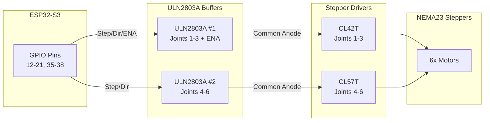
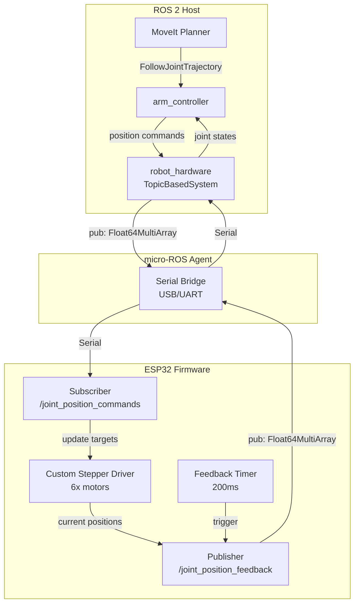

# BB01 ESP32 Controller Implementation

## Overview

The BB01_Controller firmware implements a custom stepper motor driver for the BB01 6-DOF robot arm, communicating with ROS 2 via micro-ROS. It uses a trapezoidal velocity profile with per-step kinematics for precise, loop-rate-independent motion control.

**Location:** [`src/robot_arm/robot_esp32/Controller Code/BB01_Controller/BB01_Controller.ino`](../../../../src/robot_arm/robot_esp32/Controller%20Code/BB01_Controller/BB01_Controller.ino)

## Architecture

### Hardware Layer



### Software Architecture



## Pin Mapping

### ESP32-S3 GPIO Assignment

**Motors 1-3 (ULN2803A #1 → CL42T drivers):**

| Joint | Signal | GPIO Pin | ULN2803A #1 Input |
|-------|--------|----------|-------------------|
| 1 | STEP | 12 | IN1 |
| 1 | DIR | 13 | IN2 |
| 2 | STEP | 14 | IN3 |
| 2 | DIR | 15 | IN4 |
| 3 | STEP | 17 | IN6 |
| 3 | DIR | 18 | IN7 |
| - | ENA (shared) | 16 | IN5 |

**Motors 4-6 (ULN2803A #2 → CL57T drivers):**

| Joint | Signal | GPIO Pin | ULN2803A #2 Input |
|-------|--------|----------|-------------------|
| 4 | STEP | 19 | IN1 |
| 4 | DIR | 21 | IN2 |
| 5 | STEP | **35** | IN3 |
| 5 | DIR | **36** | IN4 |
| 6 | STEP | **37** | IN5 |
| 6 | DIR | **38** | IN6 |

**Note:** Motors 5-6 use GPIO 35-38 instead of 22-26 because GPIO 22-26 are reserved for flash/PSRAM on ESP32-S3 and cannot be used for GPIO output.

**Other pins:**

| Function | GPIO Pin | Notes |
|----------|----------|-------|
| Servo (Gripper) | 4 | PWM output |
| Status LED | 2 | Built-in LED on many ESP32 boards |

### Common Anode Wiring

The stepper drivers are wired in **common anode** configuration:

- `PUL+`, `DIR+`, `ENA+` are tied to **+5V**
- ULN2803A sinks `PUL-`, `DIR-`, `ENA-` to GND when activated
- **Signal logic:** ESP32 GPIO HIGH → ULN2803A output LOW → Driver sees active LOW → ACTIVE

This means:
- `digitalWrite(STEP_PIN, HIGH)` → Step pulse active
- `digitalWrite(DIR_PIN, HIGH)` → Forward direction (DIR- LOW)
- `digitalWrite(ENA_PIN, HIGH)` → Drivers enabled (ENA- LOW)

## Custom Stepper Driver

### Design Philosophy

The custom driver was chosen over AccelStepper for:

1. **Loop-rate independence:** Uses `micros()` timing instead of relying on frequent `run()` calls
2. **Micro-ROS compatibility:** Handles serial blocking gracefully without missing steps
3. **Precise control:** Per-step speed updates with displacement-based kinematics
4. **Lower overhead:** Minimal code, no library dependencies beyond Arduino core

### StepperMotor Structure

```cpp
struct StepperMotor {
  uint8_t step_pin;        // GPIO pin for step pulse
  uint8_t dir_pin;         // GPIO pin for direction
  long current_pos;        // Current position in steps
  long target_pos;         // Target position in steps
  float speed;             // Current speed (steps/s, always >= 0)
  float max_speed;         // Maximum speed limit (steps/s)
  float accel;             // Acceleration (steps/s²)
  unsigned long last_step_us;  // Timestamp of last step (microseconds)
  int8_t dir;              // Direction: +1 forward, -1 reverse, 0 stopped
};
```

### Trapezoidal Velocity Profile

The driver implements a trapezoidal profile with three phases:

1. **Acceleration:** Speed increases from minimum (10 steps/s) to maximum
2. **Cruise:** Constant speed at maximum
3. **Deceleration:** Speed decreases to zero at target

**Speed calculation (per step):**

```cpp
// Acceleration phase: v² = v₀² + 2aΔx (where Δx = 1 step)
float v_accel = sqrt(m.speed * m.speed + 2.0f * m.accel);

// Deceleration phase: Maximum speed to stop in remaining distance
// v² = 2ad → v = sqrt(2ad)
float v_decel = sqrt(2.0f * m.accel * (float)remaining_abs);

// Take minimum of: accelerated speed, max speed, decel-limited speed
m.speed = min(min(v_accel, m.max_speed), v_decel);
```

This naturally blends all three phases without explicit state machines.

### Step Timing

Steps are triggered based on elapsed time since last step:

```cpp
unsigned long step_interval_us = (unsigned long)(1000000.0 / m.speed);
unsigned long elapsed_us = micros() - m.last_step_us;

if (elapsed_us >= step_interval_us) {
  // Pulse step pin (3us minimum per CL42T/CL57T spec)
  digitalWrite(m.step_pin, HIGH);
  delayMicroseconds(3);
  digitalWrite(m.step_pin, LOW);
  
  // Update position and speed
  m.current_pos += m.dir;
  m.last_step_us = now_us;
  // ... speed calculation ...
}
```

**Key features:**
- Uses `micros()` for precise timing (1µs resolution)
- Unsigned subtraction handles timer wrap-around correctly
- Speed only updates when a step occurs (not every loop iteration)
- Minimum step pulse width: 3µs (CL42T/CL57T requirement)

### Safety Features

1. **Minimum speed:** 10 steps/s to avoid stalling
2. **Direction change:** Speed resets to 0 when direction changes
3. **Target reached:** Speed set to 0, motor stops
4. **Message validation:** Only processes commands with exactly 6 joint values

## Motion Parameters

### Current Configuration

**Steps per revolution:** 800 (driver microstep setting)
**Gear ratio:** 19:1 (19 motor revolutions per output revolution)
**Steps per radian:** (800 × 19) / (2π) ≈ 2,420 steps/rad

**Maximum velocity:** 0.3 rad/s (output shaft)
- Equivalent to: ~726 steps/s (motor shaft)

**Maximum acceleration:** 2.4 rad/s² (output shaft)
- Equivalent to: ~5,808 steps/s² (motor shaft)

**Performance:**
- 90° rotation: ~5.4 seconds (including accel/decel)
- Minimum speed: 10 steps/s ≈ 0.004 rad/s

### Parameter Tuning

To adjust motion parameters, modify these constants in `BB01_Controller.ino`:

```cpp
// Maximum output velocity per joint (rad/s)
static const float max_velocity_rad[NUM_JOINTS] = {
  0.3, 0.3, 0.3, 0.3, 0.3, 0.3  // Adjust per joint if needed
};

// Maximum output acceleration per joint (rad/s²)
static const float max_accel_rad[NUM_JOINTS] = {
  2.4, 2.4, 2.4, 2.4, 2.4, 2.4  // Adjust per joint if needed
};
```

**Considerations:**
- Higher acceleration may cause step skipping on loaded joints
- Lower maximum velocity increases motion time but improves reliability
- Minimum speed (10 steps/s) prevents stalling but may limit fine positioning

## micro-ROS Integration

### Topics

**Subscribed:**
- `/joint_position_commands` (`std_msgs/msg/Float64MultiArray`)
  - 6 joint positions in radians
  - Updates motor targets immediately on receipt

**Published:**
- `/joint_position_feedback` (`std_msgs/msg/Float64MultiArray`)
  - 6 current joint positions in radians
  - Published every 200ms via timer callback
- `/joint_velocity_debug` (`std_msgs/msg/Float64MultiArray`)
  - 6 approximate joint velocities in rad/s
  - Published every 1000ms for diagnostics

### Message Format

**Command message:**
```yaml
data: [0.0, 0.0, 0.0, 0.0, 0.0, 0.0]  # 6 joint positions in radians
```

**Feedback message:**
```yaml
data: [0.785, 0.0, -0.523, 0.0, 0.0, 0.0]  # Current positions in radians
```

### Executor Configuration

- **Spin period:** 20ms (throttled to avoid blocking stepper updates)
- **Feedback timer:** 200ms
- **Executor:** Handles 1 subscription + 1 timer

The tight stepper loop runs continuously, with micro-ROS processing throttled to prevent serial blocking from affecting step timing.

## Loop Structure

```cpp
void loop() {
  // 1. Update all steppers (tight loop, no blocking)
  for (int i = 0; i < NUM_JOINTS; i++) {
    updateStepper(motors[i]);
  }
  
  // 2. Throttled micro-ROS processing (every 20ms)
  if (now_ms - last_spin >= SPIN_PERIOD_MS) {
    rclc_executor_spin_some(&executor, RCL_MS_TO_NS(0));
  }
  
  // 3. LED management (turn off when all motors arrive)
  // 4. Debug velocity publishing (every 1000ms)
}
```

**Key design decisions:**
- Stepper updates run every loop iteration (highest priority)
- Micro-ROS processing throttled to 20ms intervals
- Feedback publishing happens in timer callback (non-blocking for steppers)

## ESP32-S3 Compatibility

### Pin Remapping

The firmware was originally written for ESP32 (original), but tested on ESP32-S3. Critical differences:

| Pin Range | ESP32 | ESP32-S3 | Usage |
|-----------|-------|----------|-------|
| 0-21 | GPIO | GPIO | Available |
| 22-26 | GPIO | **Flash/PSRAM** | **Not available** |
| 27-34 | GPIO | GPIO | Available |
| 35-48 | Input-only | **GPIO (output-capable)** | **Available** |

**Solution:** Motors 5-6 remapped from GPIO 22-26 to GPIO 35-38.

### Compilation

The firmware compiles for both ESP32 and ESP32-S3. Ensure the correct board is selected in Arduino IDE:
- **Board:** ESP32 Arduino → "ESP32S3 Dev Module" (or your specific board)
- **Partition Scheme:** Default (or as needed)
- **USB Mode:** Hardware CDC (for micro-ROS serial)

## Debugging

### Serial Output

Serial output is minimal (115200 baud) to avoid blocking. The firmware uses micro-ROS topics for diagnostics instead.

### Status LED

- **ON:** Command received (turns on when `/joint_position_commands` received)
- **OFF:** All motors at target position

### Debug Topics

Monitor these topics for diagnostics:

```bash
# Current positions
ros2 topic echo /joint_position_feedback

# Approximate velocities
ros2 topic echo /joint_velocity_debug
```

### Common Issues

1. **Motors not moving:**
   - Check ENA_PIN is HIGH (drivers enabled)
   - Verify micro-ROS agent is running
   - Check topic: `ros2 topic echo /joint_position_commands`

2. **Motors moving wrong direction:**
   - Invert DIR pin logic in `updateStepper()` if needed
   - Or swap DIR+ and DIR- wiring

3. **GPIO errors (ESP32-S3):**
   - Ensure motors 5-6 use GPIO 35-38, not 22-26
   - Check board selection matches hardware

4. **Slow or jerky motion:**
   - Check feedback publishing isn't blocking (reduce `FEEDBACK_PERIOD_MS`)
   - Verify acceleration parameters aren't too high
   - Monitor loop timing via debug topics

## Performance Characteristics

### Timing Precision

- **Step timing:** ±1µs (via `micros()`)
- **Speed updates:** Per-step (not per-loop)
- **Loop rate:** ~50,000+ iterations/second (when idle)

### Motion Accuracy

- **Position accuracy:** ±1 step ≈ ±0.0004 rad (±0.023°)
- **Speed accuracy:** Limited by step timing resolution
- **Acceleration:** Smooth trapezoidal profile, no step skipping

### Resource Usage

- **RAM:** ~15KB (mostly micro-ROS buffers)
- **Flash:** ~200KB (including micro-ROS libraries)
- **CPU:** <10% (mostly idle, stepper updates are lightweight)

## Future Enhancements

Potential improvements:

1. **Fast GPIO:** Replace `digitalWrite()` with direct register access for lower latency
2. **Hardware FPU:** Use `sqrtf()` instead of `sqrt()` for single-precision optimization
3. **Encoder feedback:** Integrate CL42T/CL57T encoder inputs for closed-loop position verification
4. **Dual-core:** Move steppers to Core 0, micro-ROS to Core 1 (if serial blocking becomes an issue)
5. **Per-joint tuning:** Different max speeds/accelerations per joint based on load characteristics

## References

- [BB01 Controller Firmware](../../../../src/robot_arm/robot_esp32/Controller%20Code/BB01_Controller/BB01_Controller.ino)
- [Standalone Test Sketch](../../../../src/robot_arm/robot_esp32/Controller%20Code/BB01_StepperTest/BB01_StepperTest.ino)
- [Hardware Integration Plan](arduino_hardware_integration_ea3c5f2e.plan.md)
- [ESP32-S3 Pin Reference](https://docs.espressif.com/projects/esp-idf/en/latest/esp32s3/hw-reference/esp32s3/hardware.html)
