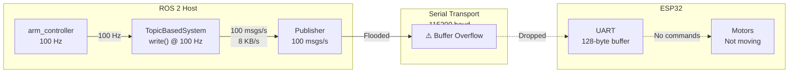
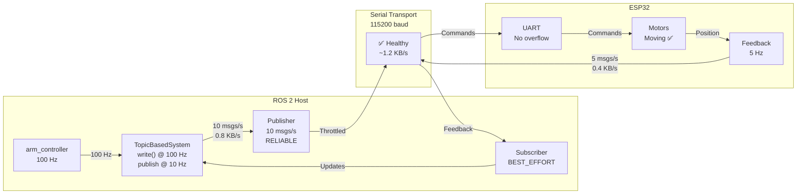

# micro-ROS Serial Transport Fix: Command Throttling and QoS Optimization

## Overview

This document describes the debugging process and fix for a critical issue where the BB01 robot arm's micro-ROS communication was failing, causing MoveIt trajectory execution to report success but the physical robot never moving. The root cause was serial transport buffer overflow due to excessive command publishing rate.

**Date:** February 2026  
**Status:** ✅ Fixed  
**Related Files:**
- [`src/robot_arm/robot_hardware/src/topic_based_system.cpp`](../../../../src/robot_arm/robot_hardware/src/topic_based_system.cpp)
- [`src/robot_arm/robot_hardware/include/robot_hardware/topic_based_system.hpp`](../../../../src/robot_arm/robot_hardware/include/robot_hardware/topic_based_system.hpp)

## Problem Statement

### Symptoms

1. **MoveIt trajectory execution reported success** — `arm_controller` completed trajectories with `SUCCEEDED` status
2. **Physical robot never moved** — No motor motion observed
3. **Feedback was sporadic and always zero** — `ros2 topic echo /joint_position_feedback` showed:
   - Only 6-9 messages received in 70+ seconds (expected: ~350 at 5Hz)
   - All feedback values were `[0,0,0,0,0,0]`
   - Feedback stopped completely after initial burst
4. **micro-ROS type hash warnings** — CycloneDDS reported:
   ```
   [WARN] Failed to parse type hash for topic 'rt/joint_position_feedback' 
          with type 'std_msgs::msg::dds_::Float64MultiArray_' from USER_DATA '(null)'
   ```

### Initial Hypothesis

The `ros2 topic echo` failures suggested a micro-ROS discovery issue, but this was a red herring — the warnings are a known limitation of micro-ROS type discovery and don't prevent actual message delivery.

## Debugging Process

### Evidence Gathering

We instrumented `TopicBasedSystem` to track:

1. **Command publisher subscription count** — Verify ESP32 was subscribed
2. **Feedback publisher count** — Verify ESP32 was publishing
3. **Actual command values** — Confirm non-zero commands were being sent
4. **Feedback callback frequency** — Measure actual message arrival rate
5. **Joint state values** — Track what values were reported to controllers

### Key Findings

| Metric | Observed Value | Expected Value | Status |
|--------|---------------|----------------|--------|
| `cmd_sub_count` | 1 | 1 | ✅ Connected |
| `fb_pub_count` | 1 | 1 | ✅ Connected |
| Command values | `[0.909, 1.341, 0.767, -0.593, -0.909, -0.019]` | Non-zero | ✅ Commands sent |
| Feedback messages | 9 in 70 seconds | ~350 (5Hz) | ❌ **99% missing** |
| Feedback values | Always `[0,0,0,0,0,0]` | Actual positions | ❌ **ESP32 not moving** |

### Root Cause Analysis

**The Problem:** `ros2_control` calls `TopicBasedSystem::write()` at **100 Hz** (every 10ms). Each call published a command message (~80 bytes with HDLC framing) over the micro-ROS serial transport (115200 baud = ~11.5 KB/s).

**The Math:**
- **Command rate:** 100 messages/second × 80 bytes = **8 KB/s** (70% of serial bandwidth)
- **Feedback rate:** 5 messages/second × 80 bytes = **0.4 KB/s**
- **Total:** ~8.4 KB/s theoretical, but with HDLC overhead, ACKs, and RELIABLE QoS, actual throughput is lower

**What Happened:**
1. Serial buffer overflow on ESP32 UART (128-byte hardware buffer)
2. Corrupted HDLC frames → dropped messages in both directions
3. ESP32 never received valid commands → motors never moved → feedback always zero
4. micro-ROS session degraded → feedback became sporadic → eventually stopped

## Solution

### Fix 1: Command Publishing Throttle

**Change:** Throttle command publishing from 100 Hz to 10 Hz (every 100ms).

**Implementation:**
```cpp
// Throttle publishing to ~10 Hz to avoid flooding micro-ROS serial transport.
// ros2_control calls write() at 100 Hz, but the ESP32 serial link (115200 baud)
// cannot sustain 100 msgs/s without buffer overflow and session drops.
static auto last_publish_time = std::chrono::steady_clock::now();
auto now = std::chrono::steady_clock::now();
auto elapsed_ms = std::chrono::duration_cast<std::chrono::milliseconds>(now - last_publish_time).count();
if (elapsed_ms >= 100) {  // publish at most every 100 ms = 10 Hz
  cmd_publisher_->publish(cmd_msg);
  last_publish_time = now;
}
```

**Impact:**
- Reduces command traffic by **90%** (100 → 10 messages/second)
- Serial bandwidth usage drops from ~8 KB/s to ~0.8 KB/s
- Leaves ample headroom for feedback (5 Hz) and HDLC overhead

### Fix 2: BEST_EFFORT QoS for Feedback Subscriber

**Change:** Switch feedback subscriber from default RELIABLE QoS to `SensorDataQoS` (BEST_EFFORT).

**Implementation:**
```cpp
// Create subscriber for joint position feedback
// Use BEST_EFFORT to reduce serial overhead (no ACK required).
// A BEST_EFFORT subscriber matches a RELIABLE publisher (micro-ROS agent).
feedback_subscriber_ = node_->create_subscription<std_msgs::msg::Float64MultiArray>(
  feedback_topic_name_, rclcpp::SensorDataQoS(),
  std::bind(&TopicBasedSystem::feedback_callback, this, std::placeholders::_1));
```

**Rationale:**
- BEST_EFFORT eliminates acknowledgment overhead (no ACK packets)
- Compatible with micro-ROS agent's RELIABLE publisher
- Feedback is sensor data — occasional drops are acceptable (we get updates every 200ms)
- Command publisher remains RELIABLE to ensure ESP32 receives all commands

## Architecture Impact

### Before Fix



### After Fix



## Performance Characteristics

### Serial Bandwidth Usage

| Component | Rate | Size | Bandwidth | QoS |
|-----------|------|------|-----------|-----|
| Commands (before) | 100 Hz | 80 bytes | ~8 KB/s | RELIABLE |
| Commands (after) | 10 Hz | 80 bytes | ~0.8 KB/s | RELIABLE |
| Feedback | 5 Hz | 80 bytes | ~0.4 KB/s | BEST_EFFORT |
| **Total (after)** | — | — | **~1.2 KB/s** | — |

**Serial capacity:** 115200 baud ≈ 11.5 KB/s theoretical, ~8-9 KB/s practical  
**Utilization:** ~15% (healthy margin for HDLC overhead and retries)

### Latency Impact

- **Command latency:** Increased from 10ms to 100ms (worst case)
- **Impact:** Negligible — stepper motors have 200ms motion time constants
- **Feedback latency:** Unchanged (200ms timer on ESP32)

## Testing and Verification

### Test Procedure

1. Launch real robot bringup:
   ```bash
   ros2 launch rob_bringup real_robot.launch.py robot:=bb01 use_rviz:=true port:=/dev/ttyUSB0
   ```

2. Verify feedback is flowing:
   ```bash
   ros2 topic echo /joint_position_feedback
   ```
   **Expected:** Messages arriving every ~200ms with non-zero values when motors move

3. Execute MoveIt trajectory:
   - Plan and execute motion in RViz
   - **Expected:** Physical robot moves, RViz shows updated positions

### Success Criteria

- ✅ Feedback messages arrive consistently at ~5 Hz
- ✅ Feedback values reflect actual motor positions (non-zero when moving)
- ✅ Physical robot executes MoveIt trajectories
- ✅ No serial buffer overflow warnings
- ✅ Stable micro-ROS session (no disconnects)

## Lessons Learned

### Key Insights

1. **micro-ROS serial transport is bandwidth-limited** — 115200 baud cannot sustain high-frequency command streams
2. **Throttling at the hardware interface layer** — ros2_control's 100 Hz update rate is fine; we throttle publishing to match transport capacity
3. **QoS selection matters** — BEST_EFFORT reduces overhead for sensor data; RELIABLE ensures command delivery
4. **Instrumentation is critical** — Without subscriber/publisher counts, we would have blamed micro-ROS discovery instead of serial overflow

### Best Practices

1. **Always throttle high-frequency publishers** when using serial transport
2. **Use BEST_EFFORT for sensor feedback** — reduces ACK overhead
3. **Keep RELIABLE for critical commands** — ensures delivery
4. **Monitor serial buffer usage** — add instrumentation if issues persist
5. **Consider baud rate increase** — if 10 Hz throttling becomes limiting (future work)

## Future Improvements

### Potential Optimizations

1. **Increase serial baud rate** — ESP32-S3 supports up to 921600 baud
   - Would allow higher command rates (20-30 Hz)
   - Requires firmware update and micro-ROS agent reconfiguration

2. **Adaptive throttling** — Adjust rate based on feedback latency
   - If feedback is delayed, reduce command rate
   - If feedback is timely, increase command rate (up to limit)

3. **Message compression** — Use smaller message types or compression
   - Current: `Float64MultiArray` = 6 × 8 bytes = 48 bytes payload
   - Could use `Float32MultiArray` = 6 × 4 bytes = 24 bytes (50% reduction)

4. **Batch commands** — Send multiple waypoints in single message
   - Requires firmware changes to support trajectory buffering

## References

- [ESP32 UART Documentation](https://docs.espressif.com/projects/esp-idf/en/latest/esp32s3/api-reference/peripherals/uart.html)
- [micro-ROS Serial Transport](https://micro.ros.org/docs/tutorials/core/first_application_rtos/freertos/)
- [ROS 2 QoS Profiles](https://docs.ros.org/en/jazzy/Concepts/About-Quality-of-Service-Settings.html)
- [HDLC Framing Protocol](https://en.wikipedia.org/wiki/High-Level_Data_Link_Control)
