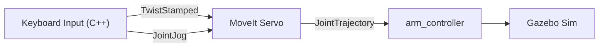

# MoveIt Servo Keyboard Control (Revised)

## Current State

- **Robot**: bb01 -- 6-DOF arm (joints 1-6)
- **Status**: Servo node is running, but Python keyboard script (`bb01_keyboard_servo.py`) was unstable (DDS errors, timeouts).
- **Goal**: Implement a robust **C++ keyboard input node** to control the robot via MoveIt Servo. This replaces the Xbox controller plan for now since hardware is unavailable.

## Architecture

## Strategy

### Phase 1 -- Servo Config (Completed)

- `bb01_servo.yaml` and `servo.launch.py` are ready.
- Singularity thresholds have been relaxed to allow starting from "candle" pose.

### Phase 2 -- C++ Keyboard Bridge (New Focus)

We will create a C++ node that reads keyboard input (using `termios` for non-blocking input) and publishes servo commands. This avoids the Python/DDS overhead issues we saw.

**Files to create/update:**

1.  **[`src/robot_arm/rob_cpp_pkg/src/keyboard_servo_node.cpp`](src/robot_arm/rob_cpp_pkg/src/keyboard_servo_node.cpp)** -- C++ node that:
    -   Reads keyboard input in a loop (non-blocking)
    -   Publishes `TwistStamped` to `/servo_node/delta_twist_cmds`
    -   Publishes `JointJog` to `/servo_node/delta_joint_cmds`
    -   Calls `/servo_node/switch_command_type` service
    -   Key mappings:
        -   `arrow keys`: X/Y translation
        -   `u/o`: Z translation
        -   `1-6`: Joint jogging
        -   `t/j`: Switch modes

2.  **Update `rob_cpp_pkg`**:
    -   Add `keyboard_servo_node` executable to `CMakeLists.txt`

3.  **Update `servo.launch.py`**:
    -   Add `use_keyboard` argument (default: `true`)
    -   Launch `keyboard_servo_node` in a separate terminal (or `xterm`) because it needs stdin access

**Keyboard Mapping:**

| Key | Action | Mode |
|---|---|---|
| **Arrow Up/Down** | Linear X +/- | Twist |
| **Arrow Left/Right** | Linear Y +/- | Twist |
| **u / o** | Linear Z +/- | Twist |
| **r / f** | Angular Yaw +/- | Twist |
| **1 - 6** | Jog Joints 1-6 | Joint Jog |
| **t** | Switch to Twist Mode | All |
| **j** | Switch to Joint Jog Mode | All |
| **q** | Quit | All |

### Phase 3 -- Tuning and Polish

-   Adjust speed scales in the C++ node or parameters
-   Verify smooth motion in Gazebo
