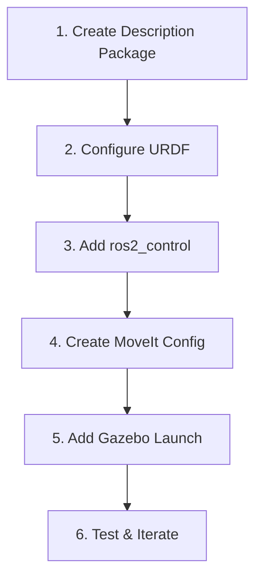

# Adding a New Robot

This guide walks through the process of integrating a new robot into the MECH490 Capstone project. Follow these steps to add a robot from URDF export through full MoveIt and Gazebo integration.

## Prerequisites

- Working ROS 2 Humble installation
- Colcon workspace set up
- Robot URDF or Xacro file
- Mesh files (STL or DAE)

## Overview



---

## Step 1: Create Description Package

### 1.1 Create Package Structure

```bash
cd ~/Capstone/MECH490-Capstone/src/robot_arm
ros2 pkg create --build-type ament_cmake <robot>_description
```

### 1.2 Add Required Directories

```bash
cd <robot>_description
mkdir -p urdf meshes launch rviz
mkdir -p urdf/control urdf/sensors  # Optional subdirectories
```

### 1.3 Update CMakeLists.txt

```cmake
cmake_minimum_required(VERSION 3.8)
project(<robot>_description)

find_package(ament_cmake REQUIRED)

# Install directories
install(DIRECTORY
  urdf
  meshes
  launch
  rviz
  DESTINATION share/${PROJECT_NAME}
)

ament_package()
```

### 1.4 Update package.xml

```xml
<?xml version="1.0"?>
<package format="3">
  <name><robot>_description</name>
  <version>0.0.1</version>
  <description>URDF description for <robot> robot</description>
  <maintainer email="you@example.com">Your Name</maintainer>
  <license>MIT</license>

  <buildtool_depend>ament_cmake</buildtool_depend>
  
  <exec_depend>robot_state_publisher</exec_depend>
  <exec_depend>joint_state_publisher</exec_depend>
  <exec_depend>joint_state_publisher_gui</exec_depend>
  <exec_depend>rviz2</exec_depend>
  <exec_depend>xacro</exec_depend>

  <export>
    <build_type>ament_cmake</build_type>
  </export>
</package>
```

---

## Step 2: Configure URDF

### 2.1 Copy Mesh Files

Place mesh files in the `meshes/` directory:
- STL files for collision geometry
- DAE files for visual geometry (optional, better appearance)

### 2.2 Create Main URDF/Xacro

Create `urdf/<robot>.urdf.xacro`:

```xml
<?xml version="1.0" encoding="utf-8"?>
<robot name="<robot>" xmlns:xacro="https://www.ros.org/wiki/xacro">

  <!-- Xacro arguments -->
  <xacro:arg name="robot_name" default="<robot>"/>
  <xacro:arg name="use_gazebo" default="true"/>
  <xacro:arg name="use_camera" default="false"/>
  <xacro:arg name="add_world" default="true"/>

  <!-- World link (optional but recommended) -->
  <xacro:if value="$(arg add_world)">
    <link name="world"/>
    <joint name="world_to_base" type="fixed">
      <parent link="world"/>
      <child link="base_link"/>
      <origin xyz="0 0 0" rpy="0 0 0"/>
    </joint>
  </xacro:if>

  <!-- Base link -->
  <link name="base_link">
    <visual>
      <geometry>
        <mesh filename="package://<robot>_description/meshes/base_link.stl"/>
      </geometry>
    </visual>
    <collision>
      <geometry>
        <mesh filename="package://<robot>_description/meshes/base_link.stl"/>
      </geometry>
    </collision>
    <inertial>
      <origin xyz="0 0 0" rpy="0 0 0"/>
      <mass value="1.0"/>
      <inertia ixx="0.01" ixy="0" ixz="0" iyy="0.01" iyz="0" izz="0.01"/>
    </inertial>
  </link>

  <!-- Add more links and joints... -->

  <!-- Include ros2_control (added in Step 3) -->
  <xacro:include filename="$(find <robot>_description)/urdf/control/<robot>_ros2_control.urdf.xacro"/>

</robot>
```

### 2.3 Important URDF Guidelines

1. **Mesh paths:** Use `package://<robot>_description/meshes/...`
2. **Inertia:** Required for Gazebo simulation
3. **Joint limits:** Set realistic limits based on physical robot
4. **Joint axes:** Use unit vectors (e.g., `0 0 1` for Z-axis)

### 2.4 Verify URDF

```bash
# Check for XML errors
ros2 run xacro xacro src/robot_arm/<robot>_description/urdf/<robot>.urdf.xacro

# Check URDF validity
ros2 run urdf_parser_plugin check_urdf <generated_urdf>
```

---

## Step 3: Add ros2_control

### 3.1 Create Hardware Interface Xacro

Create `urdf/control/<robot>_ros2_control.urdf.xacro`:

```xml
<?xml version="1.0"?>
<robot xmlns:xacro="http://www.ros.org/wiki/xacro">

  <xacro:macro name="<robot>_ros2_control" params="use_gazebo:=true">

    <ros2_control name="<Robot>System" type="system">
      <xacro:if value="${use_gazebo}">
        <hardware>
          <plugin>gz_ros2_control/GazeboSimSystem</plugin>
        </hardware>
      </xacro:if>
      <xacro:unless value="${use_gazebo}">
        <hardware>
          <plugin>my_robot_hardware/MyRobotHardware</plugin>
        </hardware>
      </xacro:unless>

      <!-- Joint 1 -->
      <joint name="joint1">
        <command_interface name="position">
          <param name="min">-1.57</param>
          <param name="max">1.57</param>
        </command_interface>
        <state_interface name="position"/>
        <state_interface name="velocity"/>
      </joint>

      <!-- Add more joints... -->

    </ros2_control>

  </xacro:macro>

</robot>
```

### 3.2 Create Gazebo Plugin Xacro

Create `urdf/control/gazebo_sim_ros2_control.urdf.xacro`:

```xml
<?xml version="1.0"?>
<robot xmlns:xacro="http://www.ros.org/wiki/xacro">

  <xacro:macro name="load_gazebo_sim_ros2_control_plugin" params="robot_name use_gazebo">
    <xacro:if value="${use_gazebo}">
      <gazebo>
        <plugin filename="gz_ros2_control-system" name="gz_ros2_control::GazeboSimROS2ControlPlugin">
          <parameters>$(find <robot>_moveit_config)/config/ros2_controllers.yaml</parameters>
          <ros>
            <namespace>${robot_name}</namespace>
          </ros>
        </plugin>
      </gazebo>
    </xacro:if>
  </xacro:macro>

</robot>
```

---

## Step 4: Create MoveIt Configuration

### 4.1 Using MoveIt Setup Assistant

```bash
ros2 launch moveit_setup_assistant setup_assistant.launch.py
```

Steps in Setup Assistant:
1. Load URDF from `<robot>_description`
2. Generate self-collision matrix
3. Define planning groups (e.g., "arm", "gripper")
4. Set up end effector
5. Define robot poses (home, ready, etc.)
6. Configure ros2_control interfaces
7. Generate package

### 4.2 Manual Configuration (Alternative)

Create `<robot>_moveit_config/config/` files:

**kinematics.yaml:**
```yaml
<robot>_arm:
  kinematics_solver: kdl_kinematics_plugin/KDLKinematicsPlugin
  kinematics_solver_search_resolution: 0.005
  kinematics_solver_timeout: 0.05
```

**joint_limits.yaml:**
```yaml
joint_limits:
  joint1:
    has_velocity_limits: true
    max_velocity: 2.0
    has_acceleration_limits: true
    max_acceleration: 5.0
```

**<robot>.srdf:**
```xml
<?xml version="1.0"?>
<robot name="<robot>">
  <group name="<robot>_arm">
    <chain base_link="base_link" tip_link="end_effector_link"/>
  </group>
  <group_state name="home" group="<robot>_arm">
    <joint name="joint1" value="0"/>
    <!-- more joints -->
  </group_state>
</robot>
```

---

## Step 5: Add Gazebo Launch

### 5.1 Option A: Add to Existing rob_gazebo

Add a new launch file `<robot>.gazebo.launch.py` to `rob_gazebo/launch/`:

```python
# Copy structure from rob.gazebo.launch.py
# Update package names:
package_name_description = '<robot>_description'
package_name_moveit = '<robot>_moveit_config'
default_robot_name = '<robot>'
```

### 5.2 Option B: Create Dedicated Package

Create `<robot>_gazebo` package with:
- `launch/<robot>.gazebo.launch.py`
- `worlds/` (or share from rob_gazebo)
- `config/ros_gz_bridge.yaml`

### 5.3 Key Launch File Components

```python
# Robot State Publisher
robot_state_publisher_cmd = IncludeLaunchDescription(
    PythonLaunchDescriptionSource([
        os.path.join(pkg_share_description, 'launch', 'robot_state_publisher.launch.py')
    ]),
    launch_arguments={
        'use_gazebo': 'true',
        'use_sim_time': 'true'
    }.items()
)

# Gazebo
start_gazebo_cmd = IncludeLaunchDescription(
    PythonLaunchDescriptionSource(
        os.path.join(pkg_ros_gz_sim, 'launch', 'gz_sim.launch.py')),
    launch_arguments=[('gz_args', [' -r -v 4 ', world_path])]
)

# Spawn Robot
start_gazebo_ros_spawner_cmd = Node(
    package='ros_gz_sim',
    executable='create',
    arguments=[
        '-topic', '/robot_description',
        '-name', robot_name,
    ]
)
```

---

## Step 6: Test and Iterate

### 6.1 Build and Source

```bash
cd ~/Capstone/MECH490-Capstone
colcon build --packages-select <robot>_description <robot>_moveit_config
source install/setup.bash
```

### 6.2 Test Visualization

```bash
ros2 launch <robot>_description display.launch.py
```

### 6.3 Test Gazebo Simulation

```bash
ros2 launch rob_gazebo <robot>.gazebo.launch.py
```

### 6.4 Test MoveIt

```bash
# Terminal 1
ros2 launch rob_gazebo <robot>.gazebo.launch.py use_rviz:=false

# Terminal 2
ros2 launch <robot>_moveit_config move_group.launch.py
```

### 6.5 Common Issues

| Issue | Solution |
|-------|----------|
| Mesh not found | Check package path in URDF |
| Robot falls through floor | Add inertia to all links |
| Joints don't move | Check ros2_control configuration |
| IK fails | Verify kinematic chain in SRDF |
| Controllers not loading | Check controller YAML and URDF namespace |

---

## Checklist Summary

- [ ] Description package created with proper structure
- [ ] URDF/Xacro with correct mesh paths
- [ ] All links have inertia defined
- [ ] All joints have limits defined
- [ ] ros2_control hardware interface added
- [ ] MoveIt configuration generated
- [ ] Planning groups defined
- [ ] Kinematics solver configured
- [ ] Gazebo launch file created
- [ ] Controllers configured and loading
- [ ] Visualization tested in RViz
- [ ] Simulation tested in Gazebo
- [ ] Motion planning tested with MoveIt

---

## Example: BB01 Integration

See [BB01 Robot Documentation](../robots/bb01.md) for a real example of this process in progress.

## Related Documentation

- [Project Overview](../architecture/project-overview.md)
- [Launch Flow](../architecture/launch-flow.md)
- [Parametrization Roadmap](parametrization-roadmap.md)
