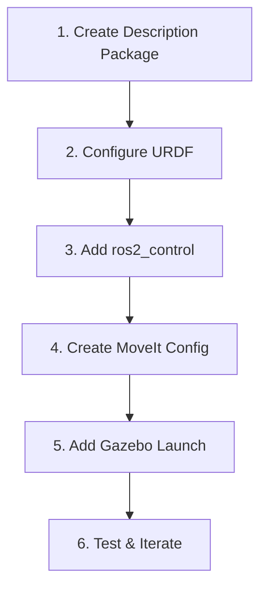

# Adding a New Robot

This guide walks through the process of integrating a new robot into the MECH490 Capstone project. Follow these steps to add a robot from URDF export through full MoveIt and Gazebo integration.

## Prerequisites

- Working ROS 2 Humble installation
- Colcon workspace set up
- Robot URDF or Xacro file
- Mesh files (STL or DAE)

## Overview



---

## Step 1: Add Robot to Unified Description Package

**Important:** The project uses a unified `robot_description` package. You do NOT create a new package. Instead, add your robot's files to the existing unified package.

### 1.1 Create Robot Directory Structure

```bash
cd ~/Capstone/MECH490-Capstone/src/robot_arm/robot_description
mkdir -p robots/<robot>/urdf/control
mkdir -p robots/<robot>/meshes
```

Replace `<robot>` with your robot's name (e.g., `my_robot`).

### 1.2 Package Structure

Your robot files will be organized as:

```
robot_description/
└── robots/
    └── <robot>/
        ├── urdf/
        │   ├── <robot>.urdf.xacro
        │   ├── <robot>.urdf
        │   └── control/
        │       ├── gazebo_sim_ros2_control.urdf.xacro
        │       └── <robot>_ros2_control.urdf.xacro
        └── meshes/
            └── *.stl or *.dae files
```

The `robot_description` package's `CMakeLists.txt` and `package.xml` already handle installation of all files in the `robots/` directory, so no changes are needed to those files.

---

## Step 2: Configure URDF

### 2.1 Copy Mesh Files

Place mesh files in the `meshes/` directory:
- STL files for collision geometry
- DAE files for visual geometry (optional, better appearance)

### 2.2 Create Main URDF/Xacro

Create `urdf/<robot>.urdf.xacro`:

```xml
<?xml version="1.0" encoding="utf-8"?>
<robot name="<robot>" xmlns:xacro="https://www.ros.org/wiki/xacro">

  <!-- Xacro arguments -->
  <xacro:arg name="robot_name" default="<robot>"/>
  <xacro:arg name="use_gazebo" default="true"/>
  <xacro:arg name="use_camera" default="false"/>
  <xacro:arg name="add_world" default="true"/>

  <!-- World link (optional but recommended) -->
  <xacro:if value="$(arg add_world)">
    <link name="world"/>
    <joint name="world_to_base" type="fixed">
      <parent link="world"/>
      <child link="base_link"/>
      <origin xyz="0 0 0" rpy="0 0 0"/>
    </joint>
  </xacro:if>

  <!-- Base link -->
  <link name="base_link">
    <visual>
      <geometry>
        <mesh filename="package://robot_description/robots/<robot>/meshes/base_link.stl"/>
      </geometry>
    </visual>
    <collision>
      <geometry>
        <mesh filename="package://robot_description/robots/<robot>/meshes/base_link.stl"/>
      </geometry>
    </collision>
    <inertial>
      <origin xyz="0 0 0" rpy="0 0 0"/>
      <mass value="1.0"/>
      <inertia ixx="0.01" ixy="0" ixz="0" iyy="0.01" iyz="0" izz="0.01"/>
    </inertial>
  </link>

  <!-- Add more links and joints... -->

  <!-- Include ros2_control (added in Step 3) -->
  <xacro:include filename="$(find robot_description)/robots/<robot>/urdf/control/<robot>_ros2_control.urdf.xacro"/>

</robot>
```

### 2.3 Important URDF Guidelines

1. **Mesh paths:** Use `package://robot_description/robots/<robot>/meshes/...`
2. **Inertia:** Required for Gazebo simulation
3. **Joint limits:** Set realistic limits based on physical robot
4. **Joint axes:** Use unit vectors (e.g., `0 0 1` for Z-axis)

### 2.4 Verify URDF

```bash
# Check for XML errors
ros2 run xacro xacro src/robot_arm/robot_description/robots/<robot>/urdf/<robot>.urdf.xacro

# Check URDF validity
ros2 run urdf_parser_plugin check_urdf <generated_urdf>
```

---

## Step 3: Add ros2_control Support

**Important:** ros2_control is **required for Gazebo physics simulation**, even if you don't have MoveIt configured yet. Without it, the robot will lack physics, joints won't generate transforms, and the robot may collapse in simulation.

### 3.1 Required Files Structure

Create the following directory structure:

```
robots/<robot>/urdf/control/
├── gazebo_sim_ros2_control.urdf.xacro  # Gazebo plugin loader
└── <robot>_ros2_control.urdf.xacro     # Joint interface definitions

robots/<robot>/config/
└── ros2_controllers.yaml                # Basic controller config (optional for basic physics)
```

### 3.2 Create Hardware Interface Xacro

Create `urdf/control/<robot>_ros2_control.urdf.xacro`:

```xml
<?xml version="1.0"?>
<robot xmlns:xacro="http://www.ros.org/wiki/xacro" name="<robot>_description">
    <xacro:macro name="<robot>_ros2_control" params="use_gazebo">

    <xacro:property name="PI" value="3.1415926535897931"/>

        <ros2_control type="system" name="<Robot>System">

            <hardware>
                <xacro:if value="${use_gazebo}">
                    <plugin>gz_ros2_control/GazeboSimSystem</plugin>
                </xacro:if>
            </hardware>

            <!-- Define interface for each joint -->
            <joint name="joint_1">
                <command_interface name="position">
                    <param name="min">-${PI/2}</param>
                    <param name="max">${PI/2}</param>
                </command_interface>
                <state_interface name="position"/>
            </joint>

            <joint name="joint_2">
                <command_interface name="position">
                    <param name="min">-${PI/2}</param>
                    <param name="max">${PI/2}</param>
                </command_interface>
                <state_interface name="position"/>
            </joint>

            <!-- Add interfaces for all remaining joints... -->

        </ros2_control>
    </xacro:macro>
</robot>
```

**Key Points:**
- **Hardware plugin:** `gz_ros2_control/GazeboSimSystem` enables Gazebo simulation
- **Command interface:** `position` allows sending position commands to joints
- **State interface:** `position` (and optionally `velocity`) provides joint state feedback
- **Joint limits:** Should match the limits defined in your URDF joints
- **All joints must be listed:** Every joint that needs physics must have an interface

**Example:** See `robot_description/robots/bb01/urdf/control/bb01_ros2_control.urdf.xacro` for a complete 6-DOF example.

### 3.3 Create Gazebo Plugin Xacro

Create `urdf/control/gazebo_sim_ros2_control.urdf.xacro`:

**Option A: With Unified MoveIt Config (Recommended)**

```xml
<?xml version="1.0"?>
<robot xmlns:xacro="http://wiki.ros.org/xacro">
    <xacro:macro name="load_gazebo_sim_ros2_control_plugin" params="robot_name use_gazebo">
        <xacro:if value="${use_gazebo}">
            <gazebo>
                <plugin filename="gz_ros2_control-system" name="gz_ros2_control::GazeboSimROS2ControlPlugin">
                    <parameters>$(find robot_moveit_config)/robots/<robot>/config/ros2_controllers.yaml</parameters>
                    <ros>
                        <remapping>/controller_manager/robot_description:=/robot_description</remapping>
                    </ros>
                </plugin>
            </gazebo>
        </xacro:if>
    </xacro:macro>
</robot>
```

**Option B: Without MoveIt Config (standalone, temporary)**

```xml
<?xml version="1.0"?>
<robot xmlns:xacro="http://wiki.ros.org/xacro">
    <xacro:macro name="load_gazebo_sim_ros2_control_plugin" params="robot_name use_gazebo">
        <xacro:if value="${use_gazebo}">
            <gazebo>
                <plugin filename="gz_ros2_control-system" name="gz_ros2_control::GazeboSimROS2ControlPlugin">
                    <parameters>$(find robot_description)/robots/<robot>/config/ros2_controllers.yaml</parameters>
                    <ros>
                        <remapping>/controller_manager/robot_description:=/robot_description</remapping>
                    </ros>
                </plugin>
            </gazebo>
        </xacro:if>
    </xacro:macro>
</robot>
```

**Note:** Once MoveIt config is created, update to Option A to use the unified `robot_moveit_config` package.

**Example:** See `robot_description/robots/bb01/urdf/control/gazebo_sim_ros2_control.urdf.xacro` for reference.

### 3.4 Create Basic Controller Config

**Location depends on whether you have MoveIt config:**

- **With MoveIt:** `robot_moveit_config/robots/<robot>/config/ros2_controllers.yaml`
- **Without MoveIt (temporary):** `robot_description/robots/<robot>/config/ros2_controllers.yaml`

For basic physics simulation, create `ros2_controllers.yaml`:

```yaml
# Basic ros2_control controller configuration for <robot>
# This minimal config enables physics simulation in Gazebo
# MoveIt trajectory controllers can be added later when MoveIt config is created

controller_manager:
  ros__parameters:
    update_rate: 100  # Hz

    # Joint state broadcaster publishes joint states to /joint_states topic
    # Required for physics simulation and transform publishing
    joint_state_broadcaster:
      type: joint_state_broadcaster/JointStateBroadcaster

# Joint state broadcaster configuration
joint_state_broadcaster:
  ros__parameters:
    # No specific parameters needed - it automatically discovers all joints
    # from the ros2_control hardware interface
```

**Note:** This minimal config is sufficient for Gazebo physics. Trajectory controllers (for MoveIt) should be added to `moveit_controllers.yaml` in the MoveIt config directory.

**Example:** See `robot_moveit_config/robots/bb01/config/ros2_controllers.yaml` for a complete example.

### 3.5 Update Main URDF to Include Control Files

Add the following includes to your main URDF file (`<robot>.urdf.xacro`) **before the closing `</robot>` tag**:

```xml
  <!-- Include Gazebo ros2_control plugin -->
  <xacro:include filename="$(find robot_description)/robots/<robot>/urdf/control/gazebo_sim_ros2_control.urdf.xacro" />
  <xacro:load_gazebo_sim_ros2_control_plugin
      robot_name="$(arg robot_name)"
      use_gazebo="$(arg use_gazebo)"/>

  <!-- Include ros2_control joint interfaces -->
  <xacro:include filename="$(find robot_description)/robots/<robot>/urdf/control/<robot>_ros2_control.urdf.xacro" />
  <xacro:<robot>_ros2_control
      use_gazebo="$(arg use_gazebo)"/>

</robot>
```

**Example:** See `robot_description/robots/bb01/urdf/bb01.urdf.xacro` (lines 417-426) for the complete include pattern.

### 3.6 Troubleshooting

| Issue | Solution |
|-------|----------|
| Robot collapses in Gazebo | Check that ros2_control is included in URDF and hardware plugin is loaded |
| Joints don't move | Verify joint interfaces are defined correctly in `<robot>_ros2_control.urdf.xacro` |
| No `/joint_states` published | Check controller config YAML exists and `joint_state_broadcaster` is configured |
| Transforms not updating | Verify `joint_state_broadcaster` is running (check with `ros2 topic echo /joint_states`) |
| Plugin not found | Ensure `gz_ros2_control-system` plugin is installed: `sudo apt install ros-humble-gz-ros2-control` |
| Controller config not found | Verify path in `gazebo_sim_ros2_control.urdf.xacro` matches actual file location |

### 3.7 Reference Examples

- **BB01 (standalone, no MoveIt):** `robot_description/robots/bb01/urdf/control/` - Complete working example without MoveIt
- **Panda (with MoveIt):** `robot_description/robots/panda/urdf/control/` - Full MoveIt integration example
- **Rob (with MoveIt):** `robot_description/robots/rob/urdf/control/` - Another MoveIt integration example

---

## Step 4: Create MoveIt Configuration

**Note:** The project uses a unified parametric MoveIt configuration package (`robot_moveit_config`). Instead of creating a separate `<robot>_moveit_config` package, you'll add your robot's configs to the existing unified package.

### 4.1 Using MoveIt Setup Assistant

```bash
ros2 launch moveit_setup_assistant setup_assistant.launch.py
```

Steps in Setup Assistant:
1. Load URDF from `robot_description` (use `robot:=<robot>` argument if needed)
2. Generate self-collision matrix
3. Define planning groups (e.g., "arm", "gripper")
4. Set up end effector (if applicable)
5. Define robot poses (home, ready, etc.)
6. Configure ros2_control interfaces
7. Generate package (you can generate to a temp location, then copy files)

**After Setup Assistant:**
Copy the generated config files to the unified package:
```bash
# Copy config files to unified structure
cp -r <temp_moveit_config>/config/* \
  src/robot_arm/robot_moveit_config/robots/<robot>/config/
```

### 4.2 Manual Configuration (Alternative)

Create config files in `robot_moveit_config/robots/<robot>/config/`:

**Directory Structure:**
```
robot_moveit_config/
  robots/
    <robot>/
      config/
        ├── <robot>.srdf
        ├── kinematics.yaml
        ├── joint_limits.yaml
        ├── moveit_controllers.yaml
        ├── ompl_planning.yaml
        ├── stomp_planning.yaml
        ├── pilz_industrial_motion_planner_planning.yaml
        ├── pilz_cartesian_limits.yaml
        └── initial_positions.yaml
```

**kinematics.yaml:**
```yaml
arm:  # or <robot>_arm depending on your planning group name
  kinematics_solver: kdl_kinematics_plugin/KDLKinematicsPlugin
  kinematics_solver_search_resolution: 0.005
  kinematics_solver_timeout: 0.05
```

**joint_limits.yaml:**
```yaml
joint_limits:
  joint_1:  # Use your actual joint names
    has_velocity_limits: true
    max_velocity: 2.0
    has_acceleration_limits: true
    max_acceleration: 5.0
```

**<robot>.srdf:**
```xml
<?xml version="1.0"?>
<robot name="<robot>">
  <group name="arm">  # or <robot>_arm
    <chain base_link="base_link" tip_link="end_effector_link"/>
  </group>
  <group_state name="home" group="arm">
    <joint name="joint_1" value="0"/>
    <!-- more joints -->
  </group_state>
</robot>
```

**Reference Examples:**
- See `robot_moveit_config/robots/bb01/config/` for a 6-DOF arm example
- See `robot_moveit_config/robots/rob/config/` for an arm with gripper example
- See `robot_moveit_config/robots/panda/config/` for a complete example

### 4.3 Update Controller Configuration

If your robot has a gripper or special controllers, you may need to update the parametric controller launcher. See `robot_moveit_config/launch/load_ros2_controllers.launch.py` and add your robot's controller sequence to the `ROBOT_CONTROLLERS` dictionary if needed.

---

## Step 5: Add Gazebo Launch

**Note:** The project uses a unified parametric Gazebo launch file (`robot_gazebo/launch/simulation.launch.py`). You typically don't need to create a new launch file - just add your robot to the configuration dictionary.

### 5.1 Add Robot to Configuration

Edit `robot_gazebo/launch/simulation.launch.py` and add your robot to the `ROBOT_CONFIGS` dictionary:

```python
ROBOT_CONFIGS = {
    'panda': {
        'description_package': 'robot_description',
        'moveit_package': 'robot_moveit_config',
        'default_z': '0.1',
    },
    'rob': {
        'description_package': 'robot_description',
        'moveit_package': 'robot_moveit_config',
        'default_z': '0.1',
    },
    'bb01': {
        'description_package': 'robot_description',
        'moveit_package': 'robot_moveit_config',
        'default_z': '0.0',
    },
    '<robot>': {  # Add your robot here
        'description_package': 'robot_description',
        'moveit_package': 'robot_moveit_config',
        'default_z': '0.0',  # Adjust based on your robot's base height
    },
}
```

Also update the `robot` argument choices:
```python
robot_arg = DeclareLaunchArgument(
    'robot',
    default_value='rob',
    choices=['panda', 'rob', 'bb01', '<robot>'],  # Add your robot
    description='Robot to simulate'
)
```

### 5.2 Launch Your Robot

Once added to the configuration, launch your robot with:

```bash
ros2 launch robot_gazebo simulation.launch.py robot:=<robot>
```

The unified launch file handles:
- Robot state publisher (with `robot:=` argument)
- Gazebo startup with proper sequencing
- ROS-Gazebo bridge
- Robot spawning (with delays to ensure Gazebo is ready)
- Controller loading (from `robot_moveit_config`)

### 5.3 Key Launch File Features

The unified `simulation.launch.py` includes:
- **Proper sequencing:** Gazebo starts first, then bridge, then robot spawns (with delays)
- **Parametric robot selection:** All robots use the same launch file
- **Automatic controller loading:** Uses `robot_moveit_config/launch/load_ros2_controllers.launch.py`
- **Configurable spawn pose:** x, y, z, roll, pitch, yaw arguments

---

## Step 6: Test and Iterate

### 6.1 Build and Source

```bash
cd ~/Capstone/MECH490-Capstone

# Source dependencies workspace if you have one
# source ~/ros2_dependencies_ws/install/setup.bash

# Build your packages
colcon build --packages-select robot_description robot_moveit_config
source install/setup.bash
```

### 6.2 Test Visualization

```bash
ros2 launch robot_description display.launch.py robot:=<robot>
```

### 6.3 Test Gazebo Simulation

```bash
# Using the unified launch file
ros2 launch robot_gazebo simulation.launch.py robot:=<robot>
```

### 6.4 Test MoveIt

```bash
# Terminal 1: Launch Gazebo simulation
ros2 launch robot_gazebo simulation.launch.py robot:=<robot> use_rviz:=false

# Terminal 2: Launch MoveIt (uses unified parametric launch)
ros2 launch robot_moveit_config move_group.launch.py robot:=<robot>
```

**Or use the bringup script:**
```bash
./src/robot_arm/rob_bringup/scripts/gazebo_and_moveit.sh <robot>
```

### 6.5 Common Issues

| Issue | Solution |
|-------|----------|
| Mesh not found | Check package path in URDF |
| Robot falls through floor | Add inertia to all links |
| Joints don't move | Check ros2_control configuration |
| IK fails | Verify kinematic chain in SRDF |
| Controllers not loading | Check controller YAML and URDF namespace |

---

## Checklist Summary

- [ ] Description package created with proper structure
- [ ] URDF/Xacro with correct mesh paths
- [ ] All links have inertia defined
- [ ] All joints have limits defined
- [ ] **ros2_control hardware interface added** (`<robot>_ros2_control.urdf.xacro`)
- [ ] **Gazebo plugin xacro created** (`gazebo_sim_ros2_control.urdf.xacro`)
- [ ] **Basic controller config created** (`ros2_controllers.yaml` with `joint_state_broadcaster`)
- [ ] **Control files included in main URDF** (before closing `</robot>` tag)
- [ ] MoveIt configuration added to `robot_moveit_config/robots/<robot>/config/`
- [ ] Planning groups defined in SRDF (MoveIt)
- [ ] Kinematics solver configured in `kinematics.yaml` (MoveIt)
- [ ] Planning pipeline configs created (`ompl_planning.yaml`, `stomp_planning.yaml`, etc.)
- [ ] Robot added to `robot_gazebo/launch/simulation.launch.py` ROBOT_CONFIGS
- [ ] Controllers configured and loading (via `robot_moveit_config`)
- [ ] Visualization tested in RViz
- [ ] **Physics simulation tested in Gazebo** (robot doesn't collapse, joints publish transforms)
- [ ] Motion planning tested with MoveIt (optional)

---

## Example: BB01 Integration

See [BB01 Robot Documentation](../robots/bb01.md) for a real example of this process in progress.

## Related Documentation

- [Project Overview](../architecture/project-overview.md)
- [Launch Flow](../architecture/launch-flow.md)
- [Parametrization Roadmap](parametrization-roadmap.md)
