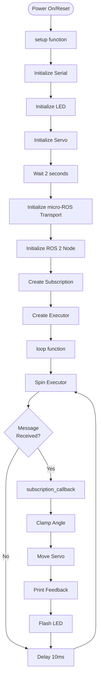

# Code Explanation

This document provides a detailed walkthrough of the ESP32 servo control code located at [`src/robot_arm/robot_esp32/ROS_Servo_Sweep/ROS_Servo_Sweep.ino`](../../../src/robot_arm/robot_esp32/ROS_Servo_Sweep/ROS_Servo_Sweep.ino).

## Code Structure

The code is organized into several sections:

1. **Includes and Libraries**
2. **Configuration Constants**
3. **Global ROS Objects**
4. **Global Servo Object**
5. **Utility Macros**
6. **Error Handling Function**
7. **Subscription Callback**
8. **Setup Function**
9. **Loop Function**

## Section-by-Section Breakdown

### 1. Includes and Libraries

```cpp
#include <micro_ros_arduino.h>
#include <stdio.h>
#include <rcl/rcl.h>
#include <rcl/error_handling.h>
#include <rclc/rclc.h>
#include <rclc/executor.h>
#include <std_msgs/msg/int32.h>
#include <ESP32Servo.h>
```

**Purpose**:
- `micro_ros_arduino.h`: Main micro-ROS Arduino library header
- `rcl/rcl.h`: ROS Client Library core functions
- `rcl/error_handling.h`: Error handling utilities
- `rclc/rclc.h`: Simplified C API for micro-ROS
- `rclc/executor.h`: Executor pattern for callbacks
- `std_msgs/msg/int32.h`: Standard ROS 2 Int32 message type
- `ESP32Servo.h`: ESP32-specific servo control library

### 2. Configuration Constants

```cpp
#define LED_PIN 2      // Use a separate pin for LED status (e.g., GPIO 2)
#define SERVO_PIN 13   // The pin connected to the servo signal wire (PWM Pin)
#define ROS_TOPIC_NAME "servo_angle"
```

**Purpose**: Centralized configuration for easy modification.

| Constant | Value | Description |
|----------|-------|-------------|
| `LED_PIN` | 2 | GPIO pin for status LED (built-in LED on many ESP32 boards) |
| `SERVO_PIN` | 13 | GPIO pin for servo PWM signal (must support PWM) |
| `ROS_TOPIC_NAME` | `"servo_angle"` | ROS 2 topic name for receiving angle commands |

### 3. Global ROS Objects

```cpp
rcl_subscription_t subscriber;
std_msgs__msg__Int32 msg_in;
rclc_executor_t executor;
rclc_support_t support;
rcl_allocator_t allocator;
rcl_node_t node;
```

**Purpose**: These objects maintain ROS 2 state throughout the program lifecycle.

| Object | Type | Purpose |
|--------|------|---------|
| `subscriber` | `rcl_subscription_t` | Subscription handle for receiving messages |
| `msg_in` | `std_msgs__msg__Int32` | Message buffer for incoming data |
| `executor` | `rclc_executor_t` | Executor for processing callbacks |
| `support` | `rclc_support_t` | Support structure for ROS 2 context |
| `allocator` | `rcl_allocator_t` | Memory allocator for ROS 2 objects |
| `node` | `rcl_node_t` | ROS 2 node handle |

### 4. Global Servo Object

```cpp
Servo servo1;
const int MIN_ANGLE = 0;
const int MAX_ANGLE = 180;
```

**Purpose**: Servo control object and safety limits.

- `servo1`: Servo object for controlling the motor
- `MIN_ANGLE`: Minimum safe angle (0 degrees)
- `MAX_ANGLE`: Maximum safe angle (180 degrees)

### 5. Utility Macros

```cpp
#define RCCHECK(fn) { rcl_ret_t temp_rc = fn; if((temp_rc != RCL_RET_OK)){error_loop();}}
#define RCSOFTCHECK(fn) { rcl_ret_t temp_rc = fn; if((temp_rc != RCL_RET_OK)){}}
```

**Purpose**: Error checking macros for ROS 2 operations.

- **`RCCHECK()`**: Critical error checking
  - If operation fails, enters `error_loop()` (infinite loop with LED flashing)
  - Used for initialization operations that must succeed
  
- **`RCSOFTCHECK()`**: Non-critical error checking
  - If operation fails, continues execution
  - Used for operations that can fail without crashing (e.g., executor spin)

### 6. Error Handling Function

```cpp
void error_loop(){
  while(1){
    digitalWrite(LED_PIN, !digitalRead(LED_PIN));
    delay(100);
  }
}
```

**Purpose**: Handles critical errors by flashing the LED rapidly.

- Enters infinite loop
- Toggles LED every 100ms
- Provides visual feedback that a critical error occurred
- Used when ROS 2 initialization fails

### 7. Subscription Callback

```cpp
void subscription_callback(const void * msgin)
{  
  const std_msgs__msg__Int32 * msg = (const std_msgs__msg__Int32 *)msgin;
  int desired_angle = msg->data;
  
  // Clamp angle to limits
  int final_angle = desired_angle;
  if (final_angle < MIN_ANGLE) {
      final_angle = MIN_ANGLE;
  } else if (final_angle > MAX_ANGLE) {
      final_angle = MAX_ANGLE;
  }

  // Move servo
  servo1.write(final_angle);

  // Feedback
  Serial.print("Received Angle: ");
  Serial.print(desired_angle);
  Serial.print(" -> Setting Servo to: ");
  Serial.println(final_angle);

  // LED feedback
  digitalWrite(LED_PIN, HIGH);
  delay(10);
  digitalWrite(LED_PIN, LOW);
}
```

**Purpose**: Called automatically when a message arrives on `/servo_angle` topic.

**Step-by-step**:
1. **Cast message**: Converts `void*` to `std_msgs__msg__Int32*`
2. **Extract data**: Gets the angle value from `msg->data`
3. **Clamp angle**: Ensures value is between 0-180 degrees (safety)
4. **Move servo**: Calls `servo1.write()` to set the angle
5. **Serial feedback**: Prints received and final angles
6. **LED flash**: Brief LED flash to indicate message received

**Safety Feature**: Angle clamping prevents servo damage from out-of-range values.

### 8. Setup Function

The `setup()` function initializes all components. Let's break it down:

#### Serial and LED Initialization

```cpp
Serial.begin(115200);
pinMode(LED_PIN, OUTPUT);
digitalWrite(LED_PIN, LOW);
```

- Starts serial communication at 115200 baud for debugging
- Configures LED pin as output
- Turns LED off initially

#### Servo Setup

```cpp
ESP32PWM::allocateTimer(0);
ESP32PWM::allocateTimer(1);
ESP32PWM::allocateTimer(2);
ESP32PWM::allocateTimer(3);

servo1.attach(SERVO_PIN, 500, 2400);
```

**Purpose**: Configures ESP32 PWM timers and attaches servo.

- **Timer allocation**: ESP32 needs timers for PWM. Allocating all 4 timers ensures servo has resources
- **Servo attach**: 
  - `SERVO_PIN`: GPIO 13
  - `500`: Minimum pulse width in microseconds (0 degrees)
  - `2400`: Maximum pulse width in microseconds (180 degrees)
  - Standard range for most servos

#### Initialization Delay

```cpp
delay(2000);
```

**Purpose**: Gives hardware time to stabilize before starting micro-ROS connection.

#### micro-ROS Initialization

```cpp
set_microros_transports();
allocator = rcl_get_default_allocator();
RCCHECK(rclc_support_init(&support, 0, NULL, &allocator));
RCCHECK(rclc_node_init_default(&node, "esp32_servo_node", "", &support));
```

**Purpose**: Initializes micro-ROS transport and creates ROS 2 node.

1. **`set_microros_transports()`**: Sets up serial transport layer
2. **`rcl_get_default_allocator()`**: Gets default memory allocator
3. **`rclc_support_init()`**: Initializes ROS 2 support structure
4. **`rclc_node_init_default()`**: Creates ROS 2 node named `esp32_servo_node`

#### Subscription Creation

```cpp
RCCHECK(rclc_subscription_init_default(
  &subscriber,
  &node,
  ROSIDL_GET_MSG_TYPE_SUPPORT(std_msgs, msg, Int32),
  ROS_TOPIC_NAME));
```

**Purpose**: Creates subscription to `/servo_angle` topic.

- **`&subscriber`**: Subscription handle
- **`&node`**: Node to attach subscription to
- **`ROSIDL_GET_MSG_TYPE_SUPPORT(...)`**: Gets message type support for `std_msgs/Int32`
- **`ROS_TOPIC_NAME`**: Topic name (`"servo_angle"`)

#### Executor Setup

```cpp
RCCHECK(rclc_executor_init(&executor, &support.context, 1, &allocator));
RCCHECK(rclc_executor_add_subscription(&executor, &subscriber, &msg_in, 
                                       &subscription_callback, ON_NEW_DATA));
```

**Purpose**: Creates executor and registers subscription callback.

1. **`rclc_executor_init()`**: 
   - Creates executor
   - `1`: Maximum number of handles (we have 1 subscription)
   
2. **`rclc_executor_add_subscription()`**:
   - Adds subscription to executor
   - `&msg_in`: Message buffer
   - `&subscription_callback`: Callback function
   - `ON_NEW_DATA`: Trigger mode (call when new data arrives)

### 9. Loop Function

```cpp
void loop() {
  RCSOFTCHECK(rclc_executor_spin_some(&executor, RCL_MS_TO_NS(100)));
  delay(10);
}
```

**Purpose**: Continuously processes incoming ROS 2 messages.

- **`rclc_executor_spin_some()`**: 
  - Checks for new messages
  - Executes callbacks if messages arrived
  - `RCL_MS_TO_NS(100)`: Timeout of 100ms (converted to nanoseconds)
  
- **`delay(10)`**: Small delay to prevent busy-looping and allow other tasks

**Why `RCSOFTCHECK()`?**: If executor spin fails, we continue trying rather than crashing.

## Execution Flow



## Key Design Decisions

### Why Serial Transport?

- Simple and reliable
- No network configuration needed
- Direct connection to host computer
- Standard for development and testing

### Why Executor Pattern?

- Non-blocking: doesn't freeze the main loop
- Efficient: only processes when needed
- Scalable: can add multiple subscriptions/services
- Standard micro-ROS pattern

### Why Angle Clamping?

- **Safety**: Prevents servo damage from invalid angles
- **Robustness**: Handles user errors gracefully
- **Feedback**: Serial output shows if clamping occurred

### Why LED Feedback?

- **Visual confirmation**: See when messages are received
- **Debugging**: Helps identify connection issues
- **User experience**: Provides immediate feedback

## Message Format

The code expects messages of type `std_msgs/msg/Int32`:

```yaml
data: <integer>
```

**Example**:
```yaml
data: 90
```

This sets the servo to 90 degrees (center position).

## Error Scenarios

### Critical Errors (Enter error_loop)

- Transport initialization failure
- Node creation failure
- Subscription creation failure
- Executor initialization failure

**Result**: LED flashes rapidly, system stops responding.

### Non-Critical Errors (Continue execution)

- Executor spin timeout (normal)
- Temporary communication issues

**Result**: System continues, will retry on next loop iteration.

## Customization Points

### Change Servo Pin

```cpp
#define SERVO_PIN 15  // Change to desired GPIO pin
```

**Note**: Must be a PWM-capable pin.

### Change Topic Name

```cpp
#define ROS_TOPIC_NAME "my_servo_angle"
```

### Change Angle Limits

```cpp
const int MIN_ANGLE = -90;  // Allow negative angles
const int MAX_ANGLE = 270;  // Extended range
```

**Warning**: Ensure your servo supports the extended range.

### Add Multiple Servos

1. Create additional `Servo` objects
2. Create additional subscriptions (one per servo)
3. Add subscriptions to executor
4. Update callback to handle multiple servos

## Next Steps

- Review the [micro-ROS Overview](micro-ros-overview.md) for architecture details
- Follow the [Setup Guide](setup-guide.md) to install and configure
- Use the [Usage Guide](usage-guide.md) to connect and test
