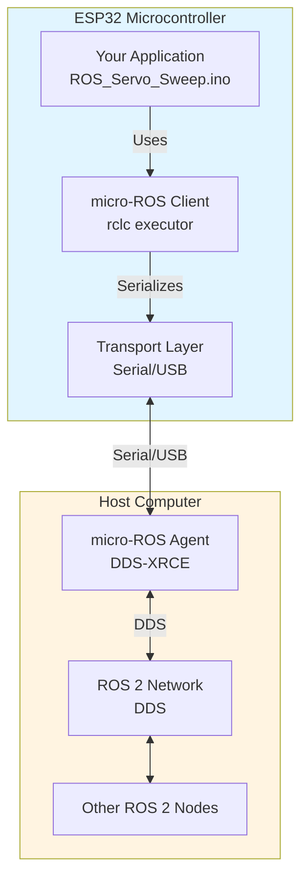
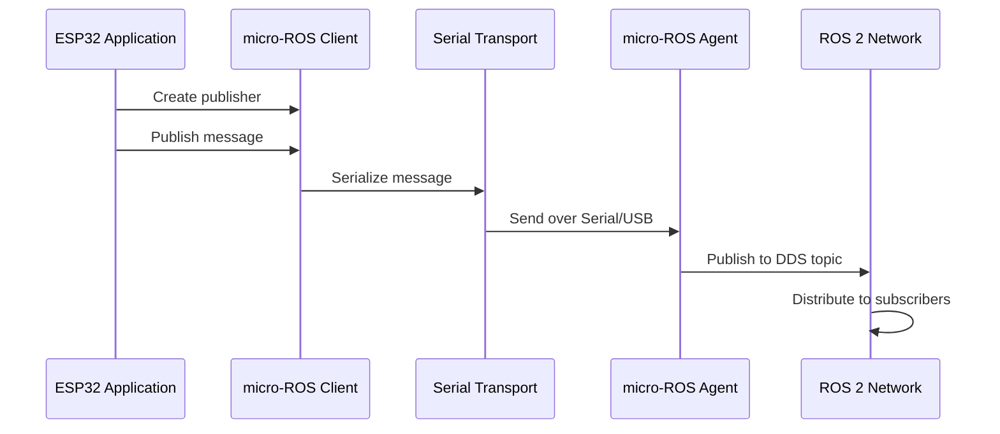
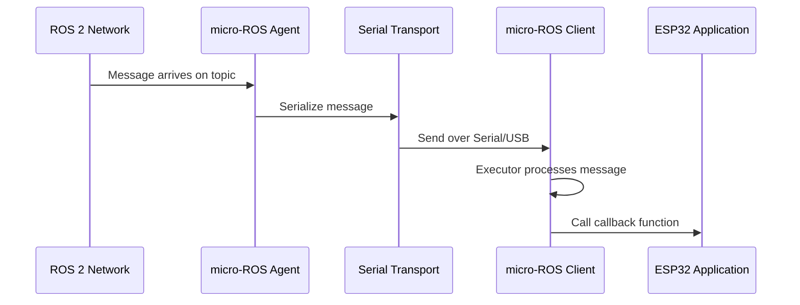

# micro-ROS Overview

This document explains what micro-ROS is, how it works, and how it enables ROS 2 communication with microcontrollers like the ESP32.

## What is micro-ROS?

micro-ROS is a lightweight implementation of ROS 2 designed for microcontrollers and embedded systems. It brings ROS 2 capabilities to resource-constrained devices that cannot run a full ROS 2 stack.

### Why micro-ROS?

Standard ROS 2 requires:
- Linux operating system
- Significant RAM and storage
- Network stack (TCP/IP)
- Multi-threading support

Microcontrollers like ESP32 have:
- Limited RAM (typically 520KB)
- No full OS (FreeRTOS instead)
- Constrained processing power
- Different communication interfaces (Serial, WiFi, etc.)

micro-ROS bridges this gap by providing a minimal ROS 2 client that runs on the microcontroller and communicates with a full ROS 2 agent running on a host computer.

## Architecture



## Key Components

### 1. micro-ROS Client (on ESP32)

The client runs on the microcontroller and provides:
- **RCL (ROS Client Library)**: Core ROS 2 API for nodes, topics, services
- **RCLC (ROS Client Library C)**: Simplified C API with executor pattern
- **Transport Abstraction**: Handles serialization and communication

### 2. micro-ROS Agent (on Host)

The agent runs on the host computer and acts as a bridge:
- Receives serialized messages from the client
- Converts them to standard ROS 2 DDS messages
- Publishes/subscribes to the ROS 2 network
- Handles discovery and connection management

### 3. Transport Layer

The transport layer handles communication between client and agent:
- **Serial/USB**: Most common, used in this project
- **WiFi/UDP**: For wireless communication
- **Custom transports**: Can be implemented for other protocols

## Communication Flow

### Publishing (ESP32 → ROS 2)



### Subscribing (ROS 2 → ESP32)



## Key Concepts

### Nodes

A ROS 2 node is a participant in the ROS 2 graph. In micro-ROS:
- Nodes are created with `rclc_node_init_default()`
- Node name: `esp32_servo_node` (in our code)
- Nodes must be initialized before creating publishers/subscribers

### Topics

Topics are named channels for message exchange:
- **Topic name**: `/servo_angle` (in our code)
- **Message type**: `std_msgs/msg/Int32`
- Topics support publish/subscribe pattern

### Subscriptions

Subscriptions allow nodes to receive messages:
- Created with `rclc_subscription_init_default()`
- Requires message type support: `ROSIDL_GET_MSG_TYPE_SUPPORT()`
- Callbacks are executed when messages arrive

### Executor

The executor manages callback execution:
- Created with `rclc_executor_init()`
- Subscriptions are added with `rclc_executor_add_subscription()`
- `rclc_executor_spin_some()` processes incoming messages
- Runs in the main loop, checking for new messages periodically

### Transport Initialization

The transport layer must be initialized before creating ROS objects:
- `set_microros_transports()` sets up the serial transport
- This is typically called in `setup()` before ROS initialization

## Comparison: micro-ROS vs Standard ROS 2

| Aspect | Standard ROS 2 | micro-ROS |
|--------|----------------|-----------|
| **Platform** | Linux, Windows, macOS | Microcontrollers (ESP32, Arduino, etc.) |
| **OS Requirement** | Full OS | RTOS (FreeRTOS) or bare metal |
| **Memory** | Hundreds of MB | Tens to hundreds of KB |
| **Transport** | TCP/IP (DDS) | Serial, WiFi, UDP (via agent) |
| **API** | rclcpp (C++), rclpy (Python) | rclc (C) |
| **Discovery** | Automatic (DDS) | Via agent |
| **Agent Required** | No | Yes (runs on host) |

## Message Serialization

micro-ROS uses a compact serialization format:
- Messages are serialized to binary format
- Sent over the transport layer (Serial/USB)
- Agent deserializes and converts to DDS format
- More efficient than XML-RPC used in ROS 1

## Executor Pattern

The executor pattern is central to micro-ROS:

```c
// Create executor
rclc_executor_init(&executor, &support.context, 1, &allocator);

// Add subscription with callback
rclc_executor_add_subscription(&executor, &subscriber, &msg_in, 
                               &subscription_callback, ON_NEW_DATA);

// In loop: spin executor to process messages
rclc_executor_spin_some(&executor, RCL_MS_TO_NS(100));
```

**Benefits**:
- Non-blocking: doesn't block the main loop
- Efficient: only processes when messages arrive
- Configurable: timeout controls how long to wait

## Error Handling

micro-ROS provides error checking macros:
- `RCCHECK()`: Critical errors, enters error loop
- `RCSOFTCHECK()`: Non-critical errors, continues execution

In our code:
- Critical errors (node creation, subscription) use `RCCHECK()`
- Non-critical errors (executor spin) use `RCSOFTCHECK()`

## Transport Mechanisms

### Serial/USB (Used in This Project)

- **Pros**: Simple, reliable, no network setup
- **Cons**: Requires physical connection
- **Use case**: Direct connection to host computer

### WiFi/UDP

- **Pros**: Wireless, can be remote
- **Cons**: Requires network configuration
- **Use case**: Remote or mobile applications

### Custom Transports

- Can implement custom transport layers
- Useful for specialized hardware or protocols

## Resources

- [micro-ROS Official Documentation](https://micro.ros.org/)
- [micro-ROS Arduino Library](https://github.com/micro-ROS/micro_ros_arduino)
- [ROS 2 Documentation](https://docs.ros.org/en/humble/)

## Next Steps

- Read the [Code Explanation](code-explanation.md) to see how these concepts are applied
- Follow the [Setup Guide](setup-guide.md) to install micro-ROS
- Use the [Usage Guide](usage-guide.md) to connect and use the system
