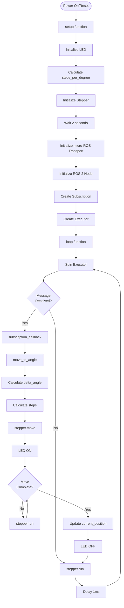

# Stepper Motor Code Explanation

This document provides a detailed walkthrough of the ESP32 stepper motor control code located at [`src/robot_arm/robot_esp32/Controller Code/ROS_Stepper_Control/ROS_Stepper_Control.ino`](../../../src/robot_arm/robot_esp32/Controller Code/ROS_Stepper_Control/ROS_Stepper_Control.ino).

## Code Structure

The code is organized into several sections:

1. **Includes and Libraries**
2. **Configuration Constants**
3. **Global Stepper Object**
4. **Position Tracking**
5. **Global ROS Objects**
6. **Utility Macros**
7. **Error Handling Function**
8. **ROS Subscription Callback**
9. **Stepper Control Functions**
10. **Setup Function**
11. **Loop Function**

## Section-by-Section Breakdown

### 1. Includes and Libraries

```cpp
#include <micro_ros_arduino.h>
#include <stdio.h>
#include <rcl/rcl.h>
#include <rcl/error_handling.h>
#include <rclc/rclc.h>
#include <rclc/executor.h>
#include <std_msgs/msg/int32.h>
#include <AccelStepper.h>
```

**Critical Note**: `micro_ros_arduino.h` **must be included first** to ensure proper micro-ROS initialization. This is essential for avoiding type hash parsing warnings.

**Purpose**:
- `micro_ros_arduino.h`: Main micro-ROS Arduino library header
- `rcl/rcl.h`: ROS Client Library core functions
- `rcl/error_handling.h`: Error handling utilities
- `rclc/rclc.h`: Simplified C API for micro-ROS
- `rclc/executor.h`: Executor pattern for callbacks
- `std_msgs/msg/int32.h`: Standard ROS 2 Int32 message type
- `AccelStepper.h`: Stepper motor control library

### 2. Configuration Constants

```cpp
#define IN1_PIN 14         // GPIO pin for coil 1
#define IN2_PIN 15         // GPIO pin for coil 2
#define IN3_PIN 16         // GPIO pin for coil 3
#define IN4_PIN 17         // GPIO pin for coil 4
#define LED_PIN 2          // LED pin for status indication
#define STEPS_PER_REV 2048  // Steps per motor revolution (0.18° per step)
#define GEAR_RATIO 19      // Gear ratio (19:1 means 19 motor revs = 1 output rev)
#define MAX_SPEED 600     // Maximum speed in steps per second
#define ACCELERATION 60   // Acceleration in steps per second^2
#define ROS_TOPIC_NAME "stepper_angle"
```

**Purpose**: Centralized configuration for easy modification.

| Constant | Value | Description |
|----------|-------|-------------|
| `IN1_PIN` - `IN4_PIN` | 14-17 | GPIO pins for stepper motor coils (4-wire control) |
| `LED_PIN` | 2 | GPIO pin for status LED (built-in LED on many ESP32 boards) |
| `STEPS_PER_REV` | 2048 | Steps per motor revolution (half-step mode, 0.18° per step) |
| `GEAR_RATIO` | 19 | Gear reduction ratio (19:1 means 19 motor revs = 1 output rev) |
| `MAX_SPEED` | 600 | Maximum speed in steps per second |
| `ACCELERATION` | 60 | Acceleration in steps per second² |
| `ROS_TOPIC_NAME` | `"stepper_angle"` | ROS 2 topic name for receiving angle commands |

### 3. Global Stepper Object

```cpp
AccelStepper stepper(AccelStepper::FULL4WIRE, IN1_PIN, IN3_PIN, IN2_PIN, IN4_PIN);
```

**Purpose**: Creates the stepper motor control object.

- **Mode**: `FULL4WIRE` for 4-pin direct control (full step mode)
- **Alternative**: `HALF4WIRE` for half-step mode (more steps, smoother motion)
- **Pin Order**: IN1, IN3, IN2, IN4 (specific to wiring configuration)

### 4. Position Tracking

```cpp
float current_position = 0.0;  // Current position in degrees
float steps_per_degree;        // Calculated steps per output degree
```

**Purpose**: Tracks absolute position in degrees (0-360 or continuous).

- `current_position`: Current angle in degrees (initialized to 0.0)
- `steps_per_degree`: Calculated in `setup()` based on motor and gear configuration

**Calculation**:
```
steps_per_degree = (STEPS_PER_REV * GEAR_RATIO) / 360
                = (2048 * 19) / 360
                ≈ 108.09 steps/degree
```

### 5. Global ROS Objects

```cpp
rcl_subscription_t subscriber;
std_msgs__msg__Int32 msg_in; // Message object to store incoming data
rclc_executor_t executor;
rclc_support_t support;
rcl_allocator_t allocator;
rcl_node_t node;
```

**Purpose**: These objects maintain ROS 2 state throughout the program lifecycle.

| Object | Type | Purpose |
|--------|------|---------|
| `subscriber` | `rcl_subscription_t` | Subscription handle for receiving messages |
| `msg_in` | `std_msgs__msg__Int32` | Message buffer for incoming data |
| `executor` | `rclc_executor_t` | Executor for processing callbacks |
| `support` | `rclc_support_t` | Support structure for ROS 2 context |
| `allocator` | `rcl_allocator_t` | Memory allocator for ROS 2 objects |
| `node` | `rcl_node_t` | ROS 2 node handle |

### 6. Utility Macros

```cpp
#define RCCHECK(fn) { rcl_ret_t temp_rc = fn; if((temp_rc != RCL_RET_OK)){error_loop();}}
#define RCSOFTCHECK(fn) { rcl_ret_t temp_rc = fn; if((temp_rc != RCL_RET_OK)){}}
```

**Purpose**: Error checking macros for ROS 2 operations.

- **`RCCHECK()`**: Critical error checking
  - If operation fails, enters `error_loop()` (infinite loop with LED flashing)
  - Used for initialization operations that must succeed
  
- **`RCSOFTCHECK()`**: Non-critical error checking
  - If operation fails, continues execution
  - Used for operations that can fail without crashing (e.g., executor spin)

### 7. Error Handling Function

```cpp
void error_loop(){
  while(1){
    digitalWrite(LED_PIN, !digitalRead(LED_PIN));
    delay(100);
  }
}
```

**Purpose**: Handles critical errors by flashing the LED rapidly.

- Enters infinite loop
- Toggles LED every 100ms
- Provides visual feedback that a critical error occurred
- Used when ROS 2 initialization fails

### 8. ROS Subscription Callback

```cpp
void subscription_callback(const void * msgin)
{  
  const std_msgs__msg__Int32 * msg = (const std_msgs__msg__Int32 *)msgin;
  int target_angle = msg->data;
  
  // Call existing move_to_angle function
  move_to_angle((float)target_angle);
}
```

**Purpose**: Called automatically when a message arrives on `/stepper_angle` topic.

**Step-by-step**:
1. **Cast message**: Converts `void*` to `std_msgs__msg__Int32*`
2. **Extract data**: Gets the angle value from `msg->data`
3. **Move stepper**: Calls `move_to_angle()` to execute the movement

**Note**: Unlike the servo code, this callback does not include Serial output, as Serial is disabled to allow micro-ROS exclusive access to the serial port.

### 9. Stepper Control Functions

#### calculate_steps()

```cpp
long calculate_steps(float angle_delta) {
  return (long)(angle_delta * steps_per_degree);
}
```

**Purpose**: Converts angle delta (in degrees) to number of steps.

- **Input**: Angle delta in degrees (can be positive or negative)
- **Output**: Number of steps (positive = CCW, negative = CW)
- **Example**: 45° delta → 45 * 108.09 ≈ 4864 steps

#### move_to_angle()

```cpp
void move_to_angle(float target_angle) {
  // Calculate angle delta
  float delta_angle = target_angle - current_position;
  
  // Calculate steps needed
  long steps = calculate_steps(delta_angle);
  
  // Move stepper
  if (steps != 0) {
    stepper.move(steps);
    
    // Flash LED to indicate movement starting
    digitalWrite(LED_PIN, HIGH);
    
    // Wait for movement to complete
    while (stepper.distanceToGo() != 0) {
      stepper.run();
    }
    
    // Update current position
    current_position = target_angle;
    
    // Turn off LED
    digitalWrite(LED_PIN, LOW);
  }
}
```

**Purpose**: Moves stepper motor to target angle (absolute positioning).

**Step-by-step**:
1. **Calculate delta**: `target_angle - current_position`
2. **Convert to steps**: Uses `calculate_steps()` to get step count
3. **Move**: Calls `stepper.move()` for relative movement
4. **LED on**: Indicates movement starting
5. **Wait for completion**: Blocks until `stepper.distanceToGo() == 0`
6. **Update position**: Sets `current_position = target_angle`
7. **LED off**: Indicates movement complete

**Key Features**:
- **Absolute positioning**: Remembers current position
- **Relative movement**: Uses `stepper.move()` for relative steps
- **Blocking**: Waits for movement to complete before returning
- **Visual feedback**: LED indicates movement state

### 10. Setup Function

The `setup()` function initializes all components:

#### Hardware Initialization

```cpp
pinMode(LED_PIN, OUTPUT);
digitalWrite(LED_PIN, LOW);

steps_per_degree = (float)(STEPS_PER_REV * GEAR_RATIO) / 360.0;

stepper.setMaxSpeed(MAX_SPEED);
stepper.setAcceleration(ACCELERATION);
stepper.setCurrentPosition(0);
```

**Purpose**: Configures LED, calculates conversion factor, and initializes stepper.

- **LED**: Configured as output, turned off initially
- **Steps per degree**: Calculated once at startup
- **Stepper configuration**: Sets speed, acceleration, and initial position

#### micro-ROS Initialization

```cpp
delay(2000);  // Give time for initialization before starting micro-ROS connection
set_microros_transports();
allocator = rcl_get_default_allocator();

RCCHECK(rclc_support_init(&support, 0, NULL, &allocator));
RCCHECK(rclc_node_init_default(&node, "esp32_stepper_node", "", &support));
```

**Purpose**: Initializes micro-ROS transport and creates ROS 2 node.

1. **Delay**: Gives hardware time to stabilize
2. **`set_microros_transports()`**: Sets up serial transport layer
3. **`rcl_get_default_allocator()`**: Gets default memory allocator
4. **`rclc_support_init()`**: Initializes ROS 2 support structure
5. **`rclc_node_init_default()`**: Creates ROS 2 node named `esp32_stepper_node`

#### Subscription Creation

```cpp
RCCHECK(rclc_subscription_init_default(
  &subscriber,
  &node,
  ROSIDL_GET_MSG_TYPE_SUPPORT(std_msgs, msg, Int32),
  ROS_TOPIC_NAME));
```

**Purpose**: Creates subscription to `/stepper_angle` topic.

- **`&subscriber`**: Subscription handle
- **`&node`**: Node to attach subscription to
- **`ROSIDL_GET_MSG_TYPE_SUPPORT(...)`**: Gets message type support for `std_msgs/Int32`
- **`ROS_TOPIC_NAME`**: Topic name (`"stepper_angle"`)

#### Executor Setup

```cpp
RCCHECK(rclc_executor_init(&executor, &support.context, 1, &allocator));
RCCHECK(rclc_executor_add_subscription(&executor, &subscriber, &msg_in, 
                                       &subscription_callback, ON_NEW_DATA));
```

**Purpose**: Creates executor and registers subscription callback.

1. **`rclc_executor_init()`**: 
   - Creates executor
   - `1`: Maximum number of handles (we have 1 subscription)
   
2. **`rclc_executor_add_subscription()`**:
   - Adds subscription to executor
   - `&msg_in`: Message buffer
   - `&subscription_callback`: Callback function
   - `ON_NEW_DATA`: Trigger mode (call when new data arrives)

### 11. Loop Function

```cpp
void loop() {
  // Spin ROS executor to check for incoming messages
  RCSOFTCHECK(rclc_executor_spin_some(&executor, RCL_MS_TO_NS(100)));
  
  // Run stepper (needed for movement execution)
  stepper.run();
  
  // Small delay to avoid busy looping
  delay(1);
}
```

**Purpose**: Continuously processes incoming ROS 2 messages and executes stepper movements.

- **`rclc_executor_spin_some()`**: 
  - Checks for new messages
  - Executes callbacks if messages arrived
  - `RCL_MS_TO_NS(100)`: Timeout of 100ms (converted to nanoseconds)
  
- **`stepper.run()`**: 
  - Must be called regularly to execute stepper movements
  - Non-blocking: returns immediately if no movement needed
  
- **`delay(1)`**: Small delay to prevent busy-looping

**Why `RCSOFTCHECK()`?**: If executor spin fails, we continue trying rather than crashing.

## Execution Flow



## Key Design Decisions

### Why No Serial Output?

- **micro-ROS requires exclusive serial access**: Serial communication conflicts with micro-ROS agent
- **Visual feedback instead**: LED provides status indication
- **ROS topics for status**: Can publish status via ROS topics if needed later

### Why Absolute Position Tracking?

- **Remembers position**: Knows where it is without homing
- **Relative movement**: Calculates delta from current to target
- **Continuous operation**: Can move in any direction from any position

### Why Blocking Movement?

- **Simpler logic**: Movement completes before next command
- **Position accuracy**: Ensures position is updated only after movement
- **LED feedback**: Clear indication of movement state

**Note**: For non-blocking operation, you could check `stepper.distanceToGo()` in the loop instead.

### Why AccelStepper Library?

- **Acceleration control**: Smooth acceleration/deceleration
- **Non-blocking option**: Can run in background (though we use blocking here)
- **Multiple modes**: Supports full-step, half-step, microstepping
- **Well-tested**: Popular and reliable library

## Message Format

The code expects messages of type `std_msgs/msg/Int32`:

```yaml
data: <integer>
```

**Example**:
```yaml
data: 45
```

This moves the stepper to 45 degrees (absolute position).

**Angle Range**: The stepper can accept any integer angle value. The code will calculate the relative movement from current position.

## Position Calculation Examples

### Example 1: Move from 0° to 45°

- Current position: 0.0°
- Target: 45°
- Delta: 45° - 0° = +45°
- Steps: 45 * 108.09 ≈ 4864 steps (CCW)
- New position: 45.0°

### Example 2: Move from 45° to 20°

- Current position: 45.0°
- Target: 20°
- Delta: 20° - 45° = -25°
- Steps: -25 * 108.09 ≈ -2702 steps (CW)
- New position: 20.0°

### Example 3: Move from 350° to 10°

- Current position: 350.0°
- Target: 10°
- Delta: 10° - 350° = -340°
- Steps: -340 * 108.09 ≈ -36,751 steps (CW, long rotation)
- New position: 10.0°

## Error Scenarios

### Critical Errors (Enter error_loop)

- Transport initialization failure
- Node creation failure
- Subscription creation failure
- Executor initialization failure

**Result**: LED flashes rapidly, system stops responding.

### Non-Critical Errors (Continue execution)

- Executor spin timeout (normal)
- Temporary communication issues

**Result**: System continues, will retry on next loop iteration.

## Customization Points

### Change Stepper Pins

```cpp
#define IN1_PIN 18  // Change to desired GPIO pins
#define IN2_PIN 19
#define IN3_PIN 21
#define IN4_PIN 22
```

**Note**: Must be digital GPIO pins. Avoid pins used for other functions.

### Change Motor Configuration

```cpp
#define STEPS_PER_REV 200   // For 1.8° per step motor (full step)
#define GEAR_RATIO 10       // Different gear ratio
```

### Change Speed and Acceleration

```cpp
#define MAX_SPEED 1000      // Faster movement
#define ACCELERATION 500    // Faster acceleration
```

**Warning**: Too high values may cause missed steps or motor stalling.

### Change Topic Name

```cpp
#define ROS_TOPIC_NAME "my_stepper_angle"
```

### Switch to Non-Blocking Movement

Modify `move_to_angle()` to not wait:

```cpp
void move_to_angle(float target_angle) {
  float delta_angle = target_angle - current_position;
  long steps = calculate_steps(delta_angle);
  
  if (steps != 0) {
    stepper.move(steps);
    digitalWrite(LED_PIN, HIGH);
    // Don't wait - let loop() handle it
  }
}
```

Then in `loop()`, check if movement is complete:

```cpp
void loop() {
  RCSOFTCHECK(rclc_executor_spin_some(&executor, RCL_MS_TO_NS(100)));
  stepper.run();
  
  // Check if movement complete
  if (stepper.distanceToGo() == 0 && digitalRead(LED_PIN) == HIGH) {
    digitalWrite(LED_PIN, LOW);
  }
  
  delay(1);
}
```

## Differences from Servo Code

| Aspect | Servo | Stepper |
|--------|-------|---------|
| **Position tracking** | No (servo has no memory) | Yes (absolute position) |
| **Movement type** | Immediate | Calculated relative movement |
| **Serial output** | Enabled | Disabled (for micro-ROS) |
| **Blocking** | Non-blocking | Blocking (waits for completion) |
| **Library** | ESP32Servo | AccelStepper |
| **Control** | PWM signal | Step/Direction pulses |

## Next Steps

- Review the [micro-ROS Overview](micro-ros-overview.md) for architecture details
- Follow the [Setup Guide](setup-guide.md) to install and configure
- Use the [Usage Guide](usage-guide.md) to connect and test
- See [README.md](README.md) for overview and quick start
