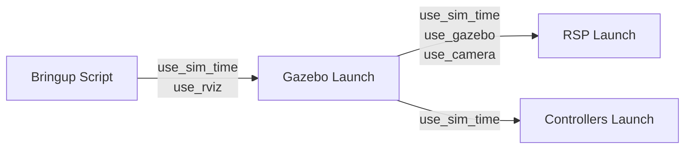

# Launch Arguments Reference

Quick reference for all launch file arguments in the MECH490 Capstone project.

## Overview

All launch files use ROS 2 launch arguments that can be passed on the command line:

```bash
ros2 launch <package> <launch_file> <arg>:=<value> <arg2>:=<value2>
```

---

## Description Package Launch Files

Located in: `robot_description/launch/`

### display.launch.py

Simple visualization launch file.

| Argument | Type | Default | Choices | Description |
|----------|------|---------|---------|-------------|
| `robot` | string | `rob` | `panda`, `rob`, `bb01` | Robot to visualize |

**Example:**
```bash
ros2 launch robot_description display.launch.py robot:=rob
ros2 launch robot_description display.launch.py robot:=panda
ros2 launch robot_description display.launch.py robot:=bb01
```

### robot_state_publisher.launch.py

Full visualization with configurable options.

| Argument | Type | Default | Choices | Description |
|----------|------|---------|---------|-------------|
| `robot` | string | `rob` | `panda`, `rob`, `bb01` | Robot name |
| `add_world` | bool | `true` | `true`, `false` | Add world link |
| `use_camera` | bool | `false` | `true`, `false` | Include RGBD camera |
| `use_gazebo` | bool | `false` | `true`, `false` | Configure for Gazebo |
| `jsp_gui` | bool | `true` | `true`, `false` | Use joint state publisher GUI |
| `use_rviz` | bool | `true` | `true`, `false` | Launch RViz |
| `use_sim_time` | bool | `false` | `true`, `false` | Use simulation time |

**Example:**
```bash
ros2 launch robot_description robot_state_publisher.launch.py robot:=panda use_gazebo:=true use_rviz:=false
```

---

## Gazebo Launch Files

### simulation.launch.py

Located in: `robot_gazebo/launch/`

Unified parametric Gazebo simulation launch for all robots.

| Argument | Type | Default | Choices | Description |
|----------|------|---------|---------|-------------|
| `robot` | string | `rob` | `panda`, `rob`, `bb01` | Robot to simulate |
| `world_file` | string | `empty.world` | - | World to load |
| `use_rviz` | bool | `false` | `true`, `false` | Launch RViz |
| `use_sim_time` | bool | `true` | `true`, `false` | Use simulation time |
| `use_camera` | bool | `false` | `true`, `false` | Enable RGBD camera |
| `use_robot_state_pub` | bool | `true` | `true`, `false` | Start RSP |
| `load_controllers` | bool | `true` | `true`, `false` | Load ros2_control controllers |
| `x` | float | `0.0` | - | Spawn X position (m) |
| `y` | float | `0.0` | - | Spawn Y position (m) |
| `z` | float | `0.1` | - | Spawn Z position (m) |
| `roll` | float | `0.0` | - | Spawn roll (rad) |
| `pitch` | float | `0.0` | - | Spawn pitch (rad) |
| `yaw` | float | `0.0` | - | Spawn yaw (rad) |

**Available Worlds:**
- `empty.world` - Empty environment
- `house.world` - Indoor house environment
- `pick_and_place_demo.world` - Demo with table and objects
- `fruits.world` - Environment with fruit objects

**Examples:**
```bash
# Basic simulation (Rob robot)
ros2 launch robot_gazebo simulation.launch.py robot:=rob

# Panda robot with custom world, no RViz
ros2 launch robot_gazebo simulation.launch.py robot:=panda world_file:=house.world use_rviz:=false

# BB01 robot with custom spawn position
ros2 launch robot_gazebo simulation.launch.py robot:=bb01 x:=1.0 y:=0.5 z:=0.0

# Rob robot with camera enabled
ros2 launch robot_gazebo simulation.launch.py robot:=rob use_camera:=true
```

---

## MoveIt Launch Files

Located in: `robot_moveit_config/launch/`

### move_group.launch.py

Unified parametric MoveIt motion planning server.

| Argument | Type | Default | Choices | Description |
|----------|------|---------|---------|-------------|
| `robot` | string | `rob` | `panda`, `rob`, `bb01` | Robot name |
| `use_sim_time` | bool | `true` | `true`, `false` | Use simulation time |
| `use_rviz` | bool | `true` | `true`, `false` | Launch MoveIt RViz |
| `rviz_config_file` | string | `move_group.rviz` | - | RViz config file |
| `rviz_config_package` | string | `robot_moveit_config` | - | Package containing RViz config |

**Example:**
```bash
ros2 launch robot_moveit_config move_group.launch.py robot:=rob
ros2 launch robot_moveit_config move_group.launch.py robot:=panda use_rviz:=false
ros2 launch robot_moveit_config move_group.launch.py robot:=bb01
```

### load_ros2_controllers.launch.py

Unified parametric controller spawning for ros2_control.

| Argument | Type | Default | Choices | Description |
|----------|------|---------|---------|-------------|
| `robot` | string | `rob` | `panda`, `rob`, `bb01` | Robot name |
| `use_sim_time` | bool | `true` | `true`, `false` | Use simulation time |

**Example:**
```bash
ros2 launch robot_moveit_config load_ros2_controllers.launch.py robot:=rob
ros2 launch robot_moveit_config load_ros2_controllers.launch.py robot:=panda
```

---

## MTC Demo Launch Files

### mtc_demos.launch.py

Located in: `rob_mtc_demos/launch/`

MoveIt Task Constructor demonstrations.

| Argument | Type | Default | Choices | Description |
|----------|------|---------|---------|-------------|
| `robot_name` | string | `rob` | `panda`, `rob`, `bb01` | Robot name |
| `use_sim_time` | bool | `true` | `true`, `false` | Use simulation time |
| `exe` | string | `alternative_path_costs` | See below | Demo executable |

**Available Demos (`exe` choices):**
- `alternative_path_costs` - Path cost optimization demo
- `cartesian` - Cartesian path planning demo
- `fallbacks_move_to` - Fallback motion strategies
- `ik_clearance_cost` - IK with clearance cost
- `modular` - Modular task construction

**Example:**
```bash
ros2 launch rob_mtc_demos mtc_demos.launch.py exe:=cartesian robot_name:=rob
ros2 launch rob_mtc_demos mtc_demos.launch.py exe:=modular robot_name:=panda
```

---

## Common Argument Patterns

### Simulation vs Real Hardware

```bash
# Simulation (default)
ros2 launch robot_gazebo simulation.launch.py robot:=rob use_sim_time:=true

# Real hardware (no Gazebo)
ros2 launch robot_description robot_state_publisher.launch.py robot:=rob use_gazebo:=false use_sim_time:=false
```

### Headless Operation (No GUI)

```bash
ros2 launch robot_gazebo simulation.launch.py robot:=rob use_rviz:=false
```

### Debug Mode

```bash
# Verbose Gazebo output
ros2 launch robot_gazebo rob.gazebo.launch.py
# Gazebo already runs with -v 4 (verbose level 4)
```

---

## Environment Variables

Some behaviors are controlled by environment variables:

| Variable | Description |
|----------|-------------|
| `GZ_SIM_RESOURCE_PATH` | Gazebo model search path |
| `ROS_DOMAIN_ID` | ROS 2 domain isolation |
| `RCUTILS_CONSOLE_OUTPUT_FORMAT` | Log output format |

Set before launching:
```bash
export GZ_SIM_RESOURCE_PATH=$GZ_SIM_RESOURCE_PATH:~/custom_models
ros2 launch robot_gazebo rob.gazebo.launch.py
```

---

## Argument Propagation

Arguments propagate between included launch files:



**Key propagated arguments:**
- `use_sim_time` - Propagates to all nodes
- `use_rviz` - Controls RViz in multiple launch files
- `robot_name` - Propagates to URDF and configs

---

## Quick Reference Card

### Start Simulation

```bash
# Any robot + MoveIt
ros2 launch robot_gazebo simulation.launch.py robot:=rob
ros2 launch robot_moveit_config move_group.launch.py robot:=rob

# Panda + MoveIt  
ros2 launch robot_gazebo simulation.launch.py robot:=panda
ros2 launch robot_moveit_config move_group.launch.py robot:=panda
```

### Visualization Only

```bash
ros2 launch robot_description display.launch.py robot:=rob
ros2 launch robot_description display.launch.py robot:=panda
ros2 launch robot_description display.launch.py robot:=bb01
```

### Run Demo

```bash
ros2 launch rob_mtc_demos mtc_demos.launch.py exe:=cartesian
```

### Useful Combinations

```bash
# Headless simulation for CI
ros2 launch robot_gazebo simulation.launch.py robot:=rob use_rviz:=false

# Empty world for testing
ros2 launch robot_gazebo simulation.launch.py robot:=rob world_file:=empty.world

# With depth camera
ros2 launch robot_gazebo simulation.launch.py robot:=rob use_camera:=true
```
